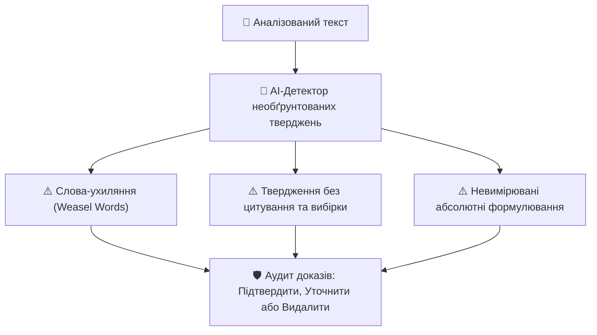

# Урок 114: Виявлення непідтверджених тверджень

## 1. Анатомія сумнівного твердження (Unsubstantiated Claims)

У технічних статтях, whitepapers та аналітичних звітах часто зустрічаються твердження, які звучать солідно, але не мають під собою жодного доказового фундаменту. Такі фрази називають **Weasel Words (Слова-ухиляння)** або голослівні заяви.

### Типові патерни непідтверджених тверджень:
1. **Анонімний авторитет**: *«Провідні експерти галузі вважають...»* (Які саме експерти? Де посилання на дослідження?).
2. **Псевдостатистика без вибірки**: *«Більшість компаній перейшли на мікросервіси...»* (Скільки відсотків? У якому сегменті? Скільки компаній опитано?).
3. **Невимірювані абсолюти**: *«Ця технологія забезпечує максимальну продуктивність та абсолютну безпеку»* (Які метрики RPS/Latency? Безпека від яких типів загроз?).

---

## 2. Шкала доказовості твердження (Hierarchy of Evidence)

| Рівень доказовості | Тип доказу | Статус твердження |
| :--- | :--- | :--- |
| 🟢 **Рівень 1 (Золотий стандарт)** | Відтворювані бенчмарки з відкритим кодом на GitHub, офіційні RFC стандарти, рецензовані академічні дослідження. | Повністю підтверджене (Verified) |
| 🟡 **Рівень 2 (Помірний)** | Корпоративні кейси відомих брендів (Case Studies), звіти аналітичних агенцій з прозорою вибіркою. | Потребує контексту (Contextual) |
| 🔴 **Рівень 3 (Неприйнятний)** | Пости в соцмережах без доказів, маркетингові буклети, чутки, фрази «всі знають, що...». | Непідтверджене / Видалити (Unsubstantiated) |

---

## 3. Автоматизація пошуку необґрунтованих тверджень через AI

Генеративні мовні моделі є чудовими аудиторами тексту, якщо їх налаштувати як суворих рецензентів:
- **Промпт «Знищувач голослівних заяв»**: «Знайди в цьому тексті всі твердження, які не містять посилання на першоджерело, числові метрики або чітко визначену методологію. Запропонуй, як їх переписати мовою точних фактів або які дані необхідно додати».
