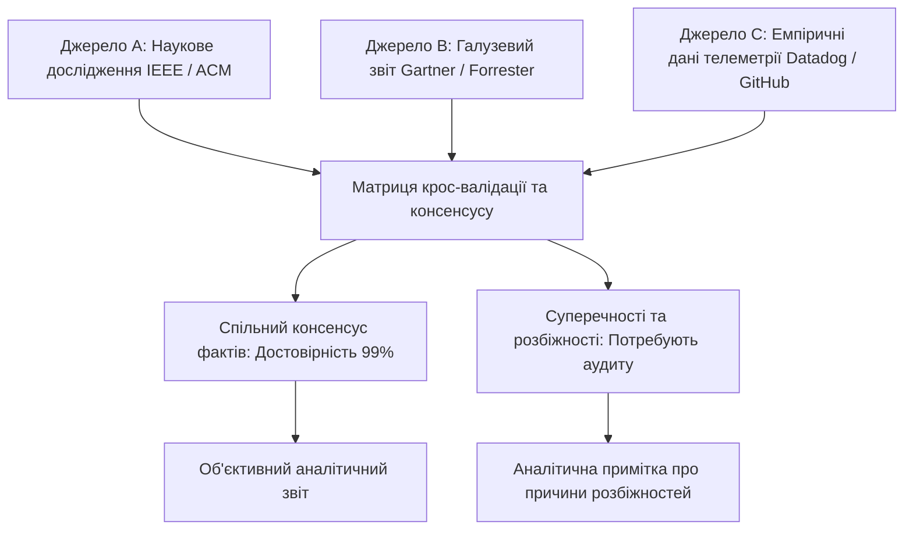
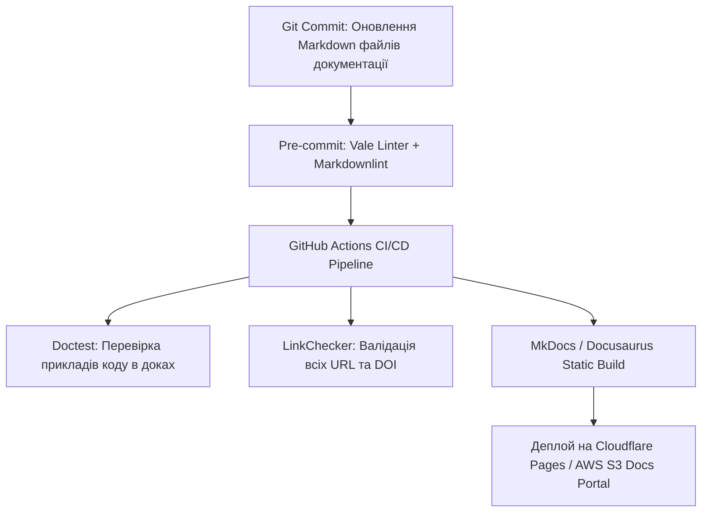

# Урок 114: Крос-валідація даних за кількома джерелами

## Вступ та теоретичний фундамент
Крос-валідація даних та метод тріангуляції джерел (Cross-Source Validation & Data Triangulation) є найвищим стандартом академічної та професійної аналітики. Покладатися на одне джерело інформації (навіть якщо це авторитетний корпоративний звіт чи наукова стаття) небезпечно через ризик авторської упередженості, застарілості вибірки, методологічних помилок або конфлікту інтересів авторів.

Тріангуляція інформації вимагає підтвердження кожного критичного твердження як мінімум трьома незалежними джерелами різного типу:
1. **Академічне джерело (Peer-Reviewed Research)**: Теоретичний фундамент та контрольовані експерименти.
2. **Галузева аналітика та ринкові дані (Industry & Market Reports)**: Реальні комерційні показники впровадження (Gartner, IDC, Bloomberg).
3. **Практичний емпіричний досвід та відкриті дані (Open Source / Real-world Telemetry)**: Реальні логи експлуатації, метрики відмов та статистика GitHub / StackOverflow.

Штучний інтелект виступає потужним інструментом синтезу та пошуку розбіжностей (Discrepancy Analysis) між різними джерелами, дозволяючи досліднику побудувати об'єктивну, збалансовану картину явища.

У цьому уроці ви опануєте алгоритми крос-валідації за допомогою AI, методики виявлення конфліктуючих даних та побудову порівняльних матриць консенсусу.

---

## 1. Архітектурні принципи та математична модель тріангуляції даних
Тріангуляція даних базується на перетині множин незалежних спостережень.




---

## 2. Методологічний базис: Порівняння рівнів узгодженості джерел
Класифікація типів розбіжностей між джерелами та методи їх інтерпретації.


| Тип розбіжності | Приклад розбіжності | Ймовірна причина | Як відобразити у звіті |
| :--- | :--- | :--- | :--- |
| **Методологічна розбіжність** | Звіт A каже про 40% проникнення AI, Звіт B — про 15% | Рівні критерії: регулярне використання vs одноразова спроба | Вказати точне формулювання запитань обох опитувань |
| **Часовий лаг (Temporal Drift)**| Звіт 2022 року фіксує спад, звіт 2024 — стрімке зростання | Ринок кардинально змінився після релізу нової технології | Навести хронологічну динаміку з поясненням тригера |
| **Географічна специфіка** | У США витрати $500/міс, у Східній Європі $80/міс | Різниця в купівельній спроможності та вартості праці | Сегментувати висновки за регіонами |
| **Конфлікт інтересів** | Постачальник CRM заявляє про 300% ROI від свого продукту | Маркетингова зацікавленість вендора у завищенні цифр | Зіставити з незалежними академічними дослідженнями |

---

## 3. Практичний інженерний регламент: Промпт для крос-валідації та синтезу конфліктних даних
Професійний системний промпт для зіставлення 3 різних звітів щодо швидкості впровадження мікросервісів.


```markdown
# =====================================================================
# ПРОМПТ ДЛЯ AI: Крос-валідація даних за трьома джерелами (Triangulation)
# =====================================================================

Ти — Principal Data Synthesizer та Research Analyst.
Ось уривки з трьох незалежних звітів щодо вартості міграції на Microservices:
[ДЖЕРЕЛО 1: Звіт DORA 2024]
[ДЖЕРЕЛО 2: Звіт Gartner Cloud Trends]
[ДЖЕРЕЛО 3: Дослідження ACM Transactions on Software Engineering]

Виконай системну крос-валідацію:
1. **Consensus Matrix**: Склади таблицю тез, за якими всі три джерела мають повну згоду (100% Consensus).
2. **Conflict & Discrepancy Breakdown**:
   - Які цифри або висновки прямо суперечать один одному?
   - Поясни першопричину кожної розбіжності (різниця у розмірі компаній, методології підрахунку, часі збору даних).
3. **Confidence Scoring**: Присвой кожному загальному висновку бал достовірності (High / Medium / Low).
4. **Synthesized Summary**: Напиши збалансоване резюме для керівництва, яке чесно відображає як консенсусні факти, так і наявні розбіжності.
```

---

## 4. Поглиблений аналіз виробничих кейсів, крайових випадків та антипатернів
Аналіз помилок через відсутність крос-валідації.


### Кейс 1: Помилка вибору технологічного стеку на основі заангажованого Whitepaper
- **Проблема**: Архітектори обрали документоорієнтовану БД на основі звіту самого вендора, де стверджувалося про 10x перевагу у швидкодії над PostgreSQL.
- **Наслідок**: У реальному продакшені при складних транзакціях система показала деградацію швидкості на 40%, оскільки в бенчмарку вендора тестувалися лише прості операції читання.
- **Виправлення**: Завжди шукати незалежні порівняльні тести (Independent Benchmarks) від нейтральних інженерних команд.

### Кейс 2: Ефект "Ехо-камери" у цитуваннях (Circular Reporting)
- **Проблема**: Три різні блоги посилалися один на одного по колу, цитуючи вигадану цифру '85% проектів AI провалюються через погані дані'.
- **Виправлення**: Трасування цитувань до першого первинного джерела.

---

## 5. Покроковий операційний воркфлоу проведення крос-валідації
Стандартний процес аналітичного дослідження.


### Крок 1: Збір мінімум трьох незалежних джерел різного типу
- Академічна стаття + Галузевий звіт + Реальна статистика експлуатації.

### Крок 2: Завантаження текстів у Claude для побудови матриці консенсусу
- Отримати перелік спільних фактів та розбіжностей.

### Крок 3: Аналіз першопричин розбіжностей (Root Cause Analysis)
- Дослідити методологію кожного звіту.

### Крок 4: Складання збалансованого фінального звіту
- Відобразити консенсусні факти та додати примітки про нюанси інтерпретації.

---

## 6. Стратегії підвищення об'єктивності аналітики
1. **Vendor Neutrality Policy**: Заборона використання досліджень, спонсорованих зацікавленими комерційними компаніями, без явного зазначення дисклеймера.
2. **Meta-Analysis Synthesis**: Надання пріоритету систематичним мета-аналізам (оглядам 50+ досліджень) над поодинокими статтями.
3. **Confidence Interval Reporting**: Завжди вказувати діапазони значень замість єдиної точкової цифри.

---

## 7. Вичерпний чек-лист перевірки та критерії готовності (Definition of Done)
Перед здачею завдань та інтеграцією результатів у виробничу гілку переконайтеся у виконанні наступних критеріїв:

- [ ] **Кожне ключове твердження підтверджено щонайменше 3 незалежними джерелами**
- [ ] **Джерела представляють різні типи (академічні, ринкові, емпіричні)**
- [ ] **Проаналізовано та пояснено всі виявлені числові або логічні розбіжності**
- [ ] **Виключено циркулярні посилання та ехо-камери (Circular Reporting)**
- [ ] **Перевірено наявність потенційного конфлікту інтересів у авторів звітів**
- [ ] **У фінальному тексті наведено діапазони та контекстні обмеження вибірок**
- [ ] **Сформовано матрицю консенсусу та присвоєно рівні достовірності**
- [ ] **Аналітичний звіт містить нейтральний та збалансований тон викладу**

---

## 8. Підсумки, ключові інсайти та розширений глосарій термінів
Опанування цієї теми формує надійний фундамент для щоденної професійної роботи. Системний підхід, формалізовані інженерні стандарти та критичний контроль результатів AI забезпечують високу швидкість та бездоганну надійність кінцевого продукту.

### Глосарій ключових понять
| Термін | Визначення та контекст застосування |
| :--- | :--- |
| **Data Triangulation** | Метод підвищення достовірності дослідження шляхом зіставлення даних, отриманих з трьох або більше різних джерел. |
| **Cross-Validation** | Процедура взаємної перевірки результатів та гіпотез за допомогою незалежних методів або наборів даних. |
| **Circular Reporting (Citogenesis)** | Ситуація, коли хибна інформація поширюється через взаємні посилання джерел один на одного по колу. |
| **Consensus Matrix** | Аналітична таблиця, що демонструє ступінь згоди різних дослідників або звітів щодо конкретних фактів. |
| **Meta-Analysis** | Статистичний аналіз, що об'єднує та узагальнює результати багатьох незалежних наукових досліджень однієї проблеми. |
| **Conflict of Interest** | Ситуація, при якій особисті чи фінансові інтереси автора можуть вплинути на об'єктивність висновків дослідження. |
| **Empirical Evidence** | Дані, отримані шляхом реального спостереження, вимірювання або практичного експерименту. |
| **Confidence Interval** | Діапазон значень, у якому з певною заданою ймовірністю (наприклад, 95%) знаходиться істинне значення параметра. |
| **Discrepancy Analysis** | Процес систематичного виявлення та пояснення причин розбіжностей між різними джерелами інформації. |
| **Vendor Bias** | Упередженість висновків у дослідженнях, профінансованих комерційними компаніями для просування власного продукту. |

---

## 9. Поглиблений аналіз архітектури науково-технічної документації та інфодизайну

### 9.1. Методологія структурування складних інженерних Whitepapers
Створення переконливого та академічно бездоганного технічного звіту вимагає дотримання структури IMRaD (Introduction, Methods, Results, and Discussion):
1. **Introduction & Problem Formulation**: Чітке визначення інженерної або наукової проблеми, її фінансовий або операційний вплив на галузь.
2. **Methods & Experimental Setup**: Повний опис методології досліджень, конфігурації тестових стендів, характеристик заліза та версій ПЗ для забезпечення 100% відтворюваності (Reproducibility).
3. **Results & Empirical Data**: Представлення результатів у вигляді стандартизованих графіків (Boxplots, CDF розподіли затримок, теплові карти пам'яті).
4. **Discussion & Threats to Validity**: Чесний аналіз обмежень дослідження, потенційних похибок вимірювання та сфер застосування отриманих висновків.

### 9.2. Автоматизація збірки та версіонування документації (Docs-as-Code Pipeline)



### 9.3. Розширений практичний кейс: Трансляція наукової статті у зрозумілий бізнес-бриф
- **Завдання**: Перетворити 40-сторінкову наукову статтю з криптографії Zero-Knowledge Proofs (ZKP) у 2-сторінковий звіт для інвесторів.
- **Рішення з AI**: Застосування техніки аналогій та видалення абстрактних формул з фокусом на практичному застосуванні: конфіденційність транзакцій, зниження комісій у 100 разів, відповідність банківській таємниці.

---

## 10. Питання для співбесіди та захист технічних текстів (Lead Technical Writer Level)

1. **Як організувати процес рецензування документації інженерами, які постійно зайняті написанням коду?**
   *Еталонна відповідь*: Впровадження концепції Docs-as-Code: документація живе в тому самому репозиторії, що й код, оновлення доків є обов'язковим критерієм приймання (Definition of Done) у Pull Request, а лінтери (Vale) автоматично виправляють стиль, економлячи час інженера.
2. **Як запобігти галюцинаціям мовних моделей при автоматичному створенні описів API?**
   *Еталонна відповідь*: Використання контрактно-орієнтованої генерації (Schema-First). Замість довільного опису коду моделі передається валідна OpenAPI специфікація, а генерація обмежується виключно наявними ендпоінтами та типами даних з обов'язковою валідацією через JSON Schema.
3. **Як виміряти ефективність та якість технічної документації?**
   *Еталонна відповідь*: Метриками самообслуговування (Deflection Rate — зниження кількості звернень до саппорту на 40%), показником CSAT/Helpfulness ('Чи була ця стаття корисною?'), часом онбордингу нових розробників у проєкт та індексами читабельності (Flesch-Kincaid / Gunning fog index).

---

## 11. Практичний регламент версіонування технічної документації та локалізації (i18n)

### 11.1. Стратегії версіонування документації (Versioned Docs Architecture)
При розвитку програмного продукту технічний письменник повинен забезпечувати підтримку документації для різних версій релізів (v1.0, v2.0, Next/Unreleased):
1. **Branch-based vs. Directory-based Versioning**: Використання можливостей генераторів сайтів (Docusaurus versions / MkDocs mike) для одночасного відображення документації для актуальної та застарілих версій API.
2. **Deprecation Warnings**: Чітке позначення застарілих методів та ендпоінтів за допомогою помітних попереджень:
   > ⚠️ **Застаріло (Deprecated in v2.4)**: Цей метод буде вилучено у версії v3.0. Використовуйте новий ендпоінт `POST /api/v2/payments`.
3. **Changelog & Release Notes Automation**: Автоматична генерація списків змін (Conventional Commits -> Release Notes) за допомогою інструментів Release Please / Semantic Release.

### 11.2. Регламент підготовки текстів до локалізації (Internationalization Best Practices)
- **Уникнення культурно-специфічних ідіом**: Пряма, нейтральна мова, що легко перекладається без втрати сенсу.
- **Врахування довжини слів (Text Expansion)**: При перекладі з англійської на українську чи німецьку довжина рядків може збільшуватися на 25-40%, що має бути враховано у дизайні верстки.
- **Формати чисел та дат**: Використання міжнародного стандарту ISO 8601 (`YYYY-MM-DD`) для уникнення плутанини між американським (`MM/DD/YYYY`) та європейським (`DD/MM/YYYY`) форматами.
