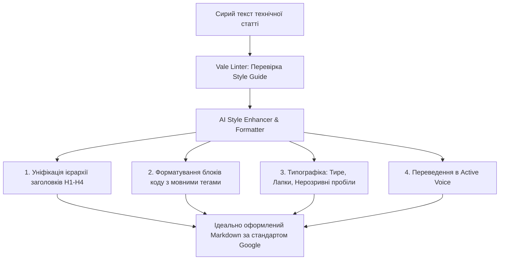
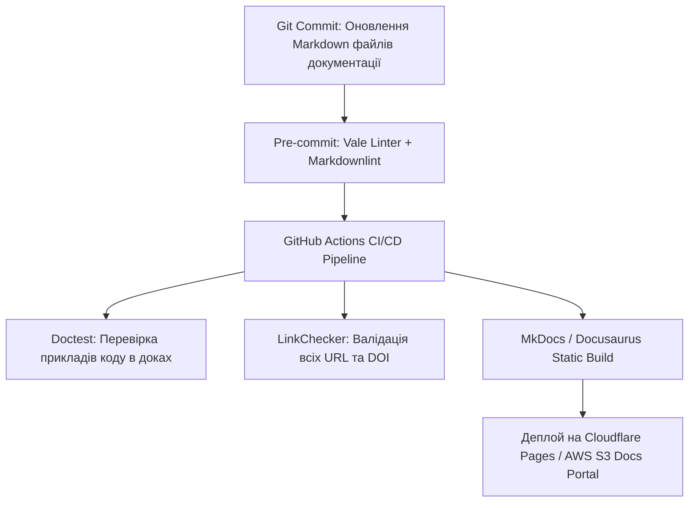

# Урок 115: Форматування матеріалу за стандартами

## Вступ та теоретичний фундамент
Оформлення та структурування технічної документації, наукових звітів та корпоративних Whitepapers вимагає суворого дотримання міжнародних видавничих та інженерних стандартів (Style Guides & Publishing Standards). Навіть найбільш глибоке дослідження втрачає авторитетність та цінність, якщо воно оформлене хаотично: з порушенням ієрархії заголовків, непослідовним форматуванням кодових вставок, некоректними таблицями або відсутністю уніфікованої термінології.

Сучасний технічний письменник повинен досконало володіти провідними світовими стандартами:
1. **Microsoft Writing Style Guide / Google Developer Documentation Style Guide**: Золотий стандарт для IT-індустрії, API-документації та інтерфейсних мікротекстів.
2. **Академічні стандарти (IEEE, APA 7th Edition, Chicago Manual of Style)**: Обов'язкові для наукових Whitepapers, технічних звітів та статей.
3. **Структурна розмітка (Semantic Markdown, DITA, AsciiDoc)**: Форматування контенту для автоматизованої генерації сайтів документації (MkDocs, Docusaurus, GitBook).
4. **Правила візуальної доступності та типографіки**: Правильне використання нерозривних пробілів, тире (— vs – vs -), лапок (« » vs " "), контрастності та розмітки таблиць.

У цьому уроці ви опануєте інструменти автоматизації форматування за допомогою AI та лінтерів прози (Vale), що забезпечують 100% відповідність корпоративним стандартам.

---

## 1. Архітектурні принципи та стандарти технічної прози
Головні принципи сучасної інженерної документації за гайдами Google та Microsoft:
- **Active Voice (Активний стан)**: "Запустіть скрипт" замість "Скрипт повинен бути запущений".
- **Direct & Concise (Прямота та лаконічність)**: Мінімум вставних слів, видалення канцелярського шуму.
- **Second Person (Друга особа)**: Звернення до читача на "ви" або в наказовій формі.
- **Consistent Terminology (Єдність термінології)**: Якщо сутність названо "ендпоінт", заборонено називати її "URL" чи "роут" у сусідньому абзаці.




---

## 2. Методологічний базис: Порівняння провідних гайдів стилю
Порівняльний аналіз вимог Google, Microsoft та APA 7th.


| Стандарт / Гайд | Цільова аудиторія | Стиль викладу | Оформлення коду та таблиць |
| :--- | :--- | :--- | :--- |
| **Google Developer Docs Style** | Програмісти, DevOps, SDET | Технічний, прямий, стислий, фокус на дію | Обов'язкове зазначення мови у fenced blocks |
| **Microsoft Style Guide** | Користувачі ПЗ, системні адміністратори | Дружній, чіткий, інклюзивний, без сленгу | Форматування UI-елементів жирним шрифтом: **File** > **Save** |
| **APA 7th Edition** | Науковці, аналітики, студенти | Академічний, формальний, об'єктивний | Суворі вимоги до нумерації таблиць та виносок |
| **Chicago Manual of Style** | Книговидавництво, довгі монографії | Літературний, вичерпний, традиційний | Складні правила для списків та бібліографії |

---

## 3. Практичний інженерний регламент: Конфігурація лінтера прози `.vale.ini`
Конфігураційний файл лінтера Vale для автоматичного контролю дотримання гайду Google.


```ini
# =====================================================================
# .vale.ini - Конфігурація лінтера стилю документації
# =====================================================================
StylesPath = .github/styles
MinAlertLevel = suggestion

Packages = Google, proselint, write-good

[*.md]
BasedOnStyles = Vale, Google, write-good

# Правила Google
Google.Passive = warning
Google.FirstPerson = warning
Google.Quotes = error
Google.Headings = error
Google.WordList = error

# Заборона складних конструкцій
write-good.E-Prime = suggestion
write-good.Passive = warning
```

---

## 4. Поглиблений аналіз виробничих кейсів, крайових випадків та антипатернів
Аналіз помилок форматування у комерційній документації.


### Кейс 1: Антипатерн "Пасивний туман" (Passive Voice Confusion)
- **Поганий текст**: "У разі натискання кнопки файли можуть бути пошкоджені системою".
- **Проблема**: Незрозуміло, хто саме натискає кнопку і що конкретно пошкоджує файли.
- **Виправлення за гайдом Google**: "Не натискайте **Видалити**, якщо процес копіювання триває. Це пошкодить файли".

### Кейс 2: Зламані блоки коду в генераторах статичних сайтів
- **Проблема**: Автор використав одинарні зворотні лапки замість потрійних fenced code blocks для багаторядкового JSON.
- **Наслідок**: Сайт документації на Docusaurus впав під час збірки з помилкою парсингу MDX.

---

## 5. Покроковий операційний воркфлоу форматування матеріалу
Алгоритм роботи технічного письменника.


### Крок 1: Запуск лінтера Vale для виявлення відхилень
- Виконати: `vale docs/`.

### Крок 2: Автоматизоване виправлення стилю через AI
- Промпт: "Перепиши цей текст за Google Developer Documentation Style Guide: переведи в Active Voice, виправ заголовки за правилом Sentence case, додай мовні теги до блоків коду".

### Крок 3: Перевірка типографіки (Typograf.ru / типографічні правила)
- Замінити дефіси на довгі тире (—) та додати нерозривні пробіли (`&nbsp;`).

### Крок 4: Збірка сайту документації та візуальний контроль
- Запустити: `mkdocs serve` та перевірити відображення у браузері.

---

## 6. Стратегії автоматизації Docs-as-Code
1. **CI/CD Vale Actions**: Автоматична перевірка стилю кожного Pull Request у репозиторії документації.
2. **Markdownlint Enforcement**: Контроль синтаксису Markdown (відсутність кількох послідовних пустих рядків, наявність Alt-текстів у зображень).
3. **Prettier for Markdown**: Автоматичне вирівнювання таблиць та перенесення рядків.

---

## 7. Вичерпний чек-лист перевірки та критерії готовності (Definition of Done)
Перед здачею завдань та інтеграцією результатів у виробничу гілку переконайтеся у виконанні наступних критеріїв:

- [ ] **Текст повністю перевірено лінтером `vale` без критичних зауважень**
- [ ] **Використано виключно активний стан (Active Voice) та прямі дієслова**
- [ ] **Заголовки структуровані строго від H1 до H4 без пропуску рівнів**
- [ ] **Усі блоки коду мають явні мовні ідентифікатори (```python, ```bash, ```json)**
- [ ] **Елементи інтерфейсу користувача виділені жирним шрифтом (**Settings** > **Save**)**
- [ ] **Типографіка уніфікована: використано довгі тире (—) та коректні лапки**
- [ ] **Таблиці відформатовані та мають чіткі заголовки колонок**
- [ ] **Сайт документації успішно збирається без помилок парсингу MDX/Markdown**

---

## 8. Підсумки, ключові інсайти та розширений глосарій термінів
Опанування цієї теми формує надійний фундамент для щоденної професійної роботи. Системний підхід, формалізовані інженерні стандарти та критичний контроль результатів AI забезпечують високу швидкість та бездоганну надійність кінцевого продукту.

### Глосарій ключових понять
| Термін | Визначення та контекст застосування |
| :--- | :--- |
| **Style Guide** | Офіційний збірник правил та стандартів оформлення, стилю, структури та граматики для авторів контенту. |
| **Vale** | Швидкісний інструмент статичного аналізу тексту (лінтер прози), що автоматично перевіряє дотримання правил Style Guide. |
| **Docs-as-Code** | Філософія написання та публікації документації тими самими інструментами, що й програмний код (Git, CI/CD, Markdown, Linters). |
| **Active Voice** | Граматична конструкція, в якій підмет є виконавцем дії (робить текст енергійним та зрозумілим). |
| **Sentence Case** | Правило капіталізації заголовків, при якому з великої літери пишеться лише перше слово та власні назви. |
| **Fenced Code Block** | Блок коду в Markdown, обмежений трьома зворотними лапками з обов'язковим зазначенням назви мови програмування. |
| **Markdownlint** | Статичний аналізатор коду для файлів Markdown, що перевіряє форматування та структуру розмітки. |
| **Docusaurus** | Сучасний генератор статичних сайтів документації на базі React від компанії Meta. |
| **MkDocs** | Швидкий та простий генератор сайтів документації на мові Python. |
| **Non-Breaking Space** | Спеціальний символ пробілу, що запобігає автоматичному розриву рядка між двома пов'язаними словами. |

---

## 9. Поглиблений аналіз архітектури науково-технічної документації та інфодизайну

### 9.1. Методологія структурування складних інженерних Whitepapers
Створення переконливого та академічно бездоганного технічного звіту вимагає дотримання структури IMRaD (Introduction, Methods, Results, and Discussion):
1. **Introduction & Problem Formulation**: Чітке визначення інженерної або наукової проблеми, її фінансовий або операційний вплив на галузь.
2. **Methods & Experimental Setup**: Повний опис методології досліджень, конфігурації тестових стендів, характеристик заліза та версій ПЗ для забезпечення 100% відтворюваності (Reproducibility).
3. **Results & Empirical Data**: Представлення результатів у вигляді стандартизованих графіків (Boxplots, CDF розподіли затримок, теплові карти пам'яті).
4. **Discussion & Threats to Validity**: Чесний аналіз обмежень дослідження, потенційних похибок вимірювання та сфер застосування отриманих висновків.

### 9.2. Автоматизація збірки та версіонування документації (Docs-as-Code Pipeline)



### 9.3. Розширений практичний кейс: Трансляція наукової статті у зрозумілий бізнес-бриф
- **Завдання**: Перетворити 40-сторінкову наукову статтю з криптографії Zero-Knowledge Proofs (ZKP) у 2-сторінковий звіт для інвесторів.
- **Рішення з AI**: Застосування техніки аналогій та видалення абстрактних формул з фокусом на практичному застосуванні: конфіденційність транзакцій, зниження комісій у 100 разів, відповідність банківській таємниці.

---

## 10. Питання для співбесіди та захист технічних текстів (Lead Technical Writer Level)

1. **Як організувати процес рецензування документації інженерами, які постійно зайняті написанням коду?**
   *Еталонна відповідь*: Впровадження концепції Docs-as-Code: документація живе в тому самому репозиторії, що й код, оновлення доків є обов'язковим критерієм приймання (Definition of Done) у Pull Request, а лінтери (Vale) автоматично виправляють стиль, економлячи час інженера.
2. **Як запобігти галюцинаціям мовних моделей при автоматичному створенні описів API?**
   *Еталонна відповідь*: Використання контрактно-орієнтованої генерації (Schema-First). Замість довільного опису коду моделі передається валідна OpenAPI специфікація, а генерація обмежується виключно наявними ендпоінтами та типами даних з обов'язковою валідацією через JSON Schema.
3. **Як виміряти ефективність та якість технічної документації?**
   *Еталонна відповідь*: Метриками самообслуговування (Deflection Rate — зниження кількості звернень до саппорту на 40%), показником CSAT/Helpfulness ('Чи була ця стаття корисною?'), часом онбордингу нових розробників у проєкт та індексами читабельності (Flesch-Kincaid / Gunning fog index).

---

## 11. Практичний регламент версіонування технічної документації та локалізації (i18n)

### 11.1. Стратегії версіонування документації (Versioned Docs Architecture)
При розвитку програмного продукту технічний письменник повинен забезпечувати підтримку документації для різних версій релізів (v1.0, v2.0, Next/Unreleased):
1. **Branch-based vs. Directory-based Versioning**: Використання можливостей генераторів сайтів (Docusaurus versions / MkDocs mike) для одночасного відображення документації для актуальної та застарілих версій API.
2. **Deprecation Warnings**: Чітке позначення застарілих методів та ендпоінтів за допомогою помітних попереджень:
   > ⚠️ **Застаріло (Deprecated in v2.4)**: Цей метод буде вилучено у версії v3.0. Використовуйте новий ендпоінт `POST /api/v2/payments`.
3. **Changelog & Release Notes Automation**: Автоматична генерація списків змін (Conventional Commits -> Release Notes) за допомогою інструментів Release Please / Semantic Release.

### 11.2. Регламент підготовки текстів до локалізації (Internationalization Best Practices)
- **Уникнення культурно-специфічних ідіом**: Пряма, нейтральна мова, що легко перекладається без втрати сенсу.
- **Врахування довжини слів (Text Expansion)**: При перекладі з англійської на українську чи німецьку довжина рядків може збільшуватися на 25-40%, що має бути враховано у дизайні верстки.
- **Формати чисел та дат**: Використання міжнародного стандарту ISO 8601 (`YYYY-MM-DD`) для уникнення плутанини між американським (`MM/DD/YYYY`) та європейським (`DD/MM/YYYY`) форматами.
