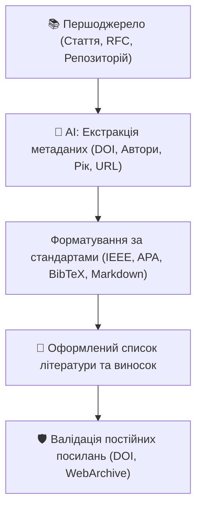

# Урок 115: Цитування та посилання в академічному та технічному письмі

## 1. Культура цитування та запобігання академічній недоброчесності

У технічній документації та наукових звітах посилання на першоджерела виконують три ключові функції:
1. **Верифікованість**: дають можливість читачу самостійно перевірити первинні дані, контекст експерименту та формули.
2. **Академічна доброчесність**: визнають внесок первинних авторів та захищають від звинувачень у плагіаті чи несанкціонованому запозиченні.
3. **Контекстна глибина**: позбавляють потреби переказувати загальновідомі фундаментальні концепції, спрямовуючи читача до офіційних RFC, стандартів ISO/IEEE або Whitepapers.

---

## 2. Стандарти оформлення посилань у технологічній сфері

| Стиль | Де застосовується | Приклад оформлення |
| :--- | :--- | :--- |
| **IEEE Style** | Комп'ютерні науки, інженерія, IEEE транзакції | `[1] J. Smith and A. Doe, "High-Performance Vector Indexing," IEEE Trans. Knowl. Data Eng., vol. 35, no. 4, pp. 112–125, 2024.` |
| **APA 7th** | Соціальні науки, UX-дослідження, бізнес-аналітика | `Smith, J., & Doe, A. (2024). High-Performance Vector Indexing. Journal of Systems, 35(4), 112–125. https://doi.org/10.xxxx` |
| **BibTeX** | LaTeX документи, наукові препринти arXiv | `@article{smith2024vector, author={Smith, J. and Doe, A.}, title={...}, year={2024}}` |
| **GitHub Markdown** | Open-source документація, MkDocs, Docusaurus | `Див. офіційну специфікацію [RFC 9110](https://www.rfc-editor.org/rfc/rfc9110).` |

---

## 3. Використання AI для автоматизації цитування

Генеративні мовні моделі є незамінними помічниками для управління бібліографією:
1. **Конвертація форматів**: миттєве перетворення посилання з сирого URL або назви статті у бездоганний BibTeX / IEEE формат.
2. **Екстракція DOI та метаданих**: витягування імен авторів, тому, номера сторінок та видавництва з тексту PDF.
3. **Генерація виносок Markdown (Footnotes)**: автоматичне створення структурованих приміток `[^1]` у статтях.
