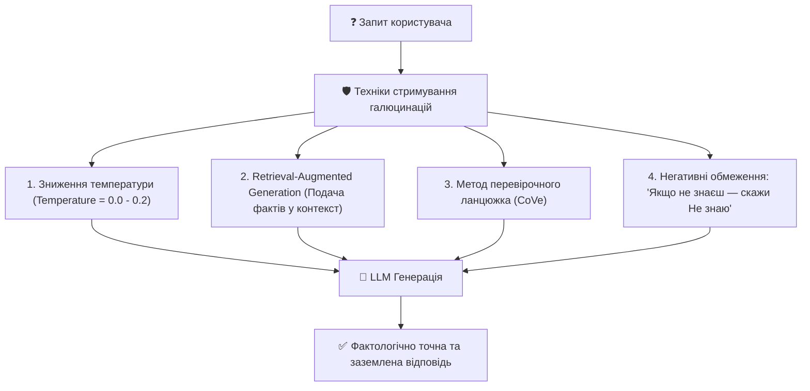

# Урок 116: Контроль AI hallucinations

## 1. Природа та механіка виникнення галюцинацій у мовних моделях

Великі мовні моделі (LLM) за своєю архітектурою є ймовірнісними передбачувачами наступного токена (Next-token Predictors), а не детермінованими базами знань. Вони навчені генерувати текст, який виглядає граматично правильним, послідовним та переконливим.

**AI-галюцинація (Hallucination)** — це генерація моделлю інформації, яка звучить надзвичайно впевнено та правдоподібно, але фактично є повністю вигаданою, неіснуючою або суперечить реальності.



---

## 2. Класифікація типів AI-галюцинацій у Research & Tech Writing

| Тип галюцинації | Опис | Приклад |
| :--- | :--- | :--- |
| **Фантомні сутності (Phantom Entities)** | Вигадування неіснуючих бібліотек, функцій або вчених | Виклик `import neural_fast_optimizer_v4` у Python |
| **Фактологічні спотворення (Factual Distortion)** | Правильна сутність, але хибні властивості або дати | «Python 3.0 вийшов у 2020 році» |
| **Сфабриковані цитати (Fabricated Citations)** | Створення посилань на статті з реальними іменами авторів, але вигаданими назвами та DOI | Неіснуюча стаття Джеффрі Хінтона про CSS |
| **Логічні підміни (Reasoning Fallacies)** | Правильні передумови, але хибний висновок | «Оскільки шифрування складне, воно не працює на телефонах» |

---

## 3. Інженерні методи боротьби з галюцинаціями

### А. Техніка Chain of Verification (CoVe)
1. **Генерація базової відповіді**.
2. **Створення перевірочних запитань**: модель сама генерує список фактів, які необхідно верифікувати у своїй чернетці.
3. **Незалежна відповідь на перевірочні питання** без огляду на чернетку.
4. **Синтез фінальної верифікованої відповіді**.

### Б. Strict Context-Only Prompting
```markdown
ІНСТРУКЦІЯ ДЛЯ AI:
Відповідай на запитання ВИКЛЮЧНО на основі тексту нижче.
Якщо відповіді немає в тексті, напиши: «Інформація відсутня в наданих документах».
НІКОЛИ не використовуй зовнішні знання і не додумуй деталі.
```
