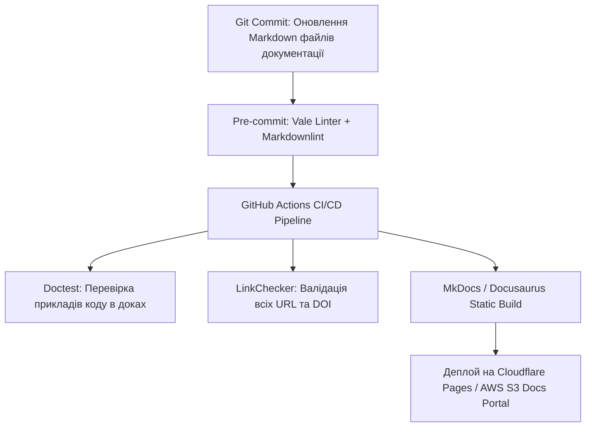

# Урок 116: Створення списків джерел, цитувань та бібліографії

## Вступ та теоретичний фундамент
Коректне оформлення бібліографічних посилань, списків використаних джерел та внутрішньовідрядкових цитувань (Citation Management & Bibliography Standards) — обов'язкова вимога академічної доброчесності та професійного авторитету будь-якого науково-технічного звіту. Помилки у цитуванні, пропущені імена співавторів, відсутність DOI або порушення формату бібліографічного стилю можуть призвести до відхилення статті редакцією журналу чи звинувачень у недбалості (Plagiarism Allegations).

Технічний дослідник повинен орієнтуватися у провідних світових бібліографічних стандартах:
1. **IEEE Standard**: Стандарт для технічних та інженерних дисциплін з нумерованими посиланнями у квадратних дужках `[1]`, `[2]`.
2. **APA 7th Edition (American Psychological Association)**: Найпопулярніший стиль для соціальних, продуктових та бізнес-досліджень `(Author, Year)`.
3. **BibTeX / CSL (Citation Style Language)**: Машиночитабельні формати збереження метаданих джерел для систем автоматичної верстки (LaTeX, Pandoc, Typst).
4. **Менеджери бібліографії (Zotero, Mendeley)**: Системи централізованого збереження PDF-документів та синхронізації метаданих.

Штучний інтелект кардинально спрощує цей процес, дозволяючи автоматично конвертувати посилання на сайти та ідентифікатори DOI у бездоганно оформлені бібліографічні записи в будь-якому цільовому стандарті.

У цьому уроці ви опануєте інструменти автоматизованого управління цитуваннями за допомогою AI, роботу з BibTeX та інтеграцію Zotero у робочий процес технічного автора.

---

## 1. Архітектурні принципи та структури збереження бібліографічних метаданих
Машиночитабельне цитування базується на стандартизованих схемах даних BibTeX та CSL-JSON.


```mermaid
graph TD
    RawArticle[Наукова стаття / DOI / URL сторінки] --> Zotero[Zotero Reference Manager]
    Zotero --> BibTeX[BibTeX Database: references.bib]
    BibTeX --> AI_Formatter[AI Citation Converter]
    AI_Formatter --> Out_IEEE[IEEE Format: [1] Author, Title, Year]
    AI_Formatter --> Out_APA[APA 7th: Author, A. (Year). Title. Publisher]
    AI_Formatter --> Out_Chicago[Chicago Notes & Bibliography]
    Out_IEEE --> FinalPublication[Готова науково-технічна стаття]
    Out_APA --> FinalPublication
    Out_Chicago --> FinalPublication
```

---

## 2. Методологічний базис: Порівняння форматів IEEE та APA 7th
Порівняльний аналіз структури цитувань за двома головними світовими стандартами.


| Елемент цитування | Стандарт IEEE (Engineering) | Стандарт APA 7th (Business / Science) |
| :--- | :--- | :--- |
| **Внутрішньотекстове посилання** | `Як показано в [1], алгоритм...` або `...швидше на 20% [2], [3].` | `(Smith & Jones, 2023)` або `Smith and Jones (2023) стверджують...` |
| **Сортування бібліографії** | У порядку першої появи в тексті (Numeric Order: [1], [2]...) | В алфавітному порядку за прізвищем першого автора |
| **Формат для журналу** | `[1] J. K. Author, "Name of paper," Abbrev. Title of Periodical, vol. x, no. x, pp. xxx-xxx, Month, Year, doi: xxx.` | `Author, A. A., & Author, B. B. (Year). Title of article. Title of Periodical, xx(x), pp–pp. https://doi.org/xxx` |
| **Формат для сайту** | `[2] "Title of web page," Website Name. URL (accessed Month Day, Year).` | `Author, A. A. (Year, Month Day). Title of page. Website Name. URL` |

---

## 3. Практичний інженерний регламент: Еталонний файл BibTeX та промпт конвертації
Приклад збереження метаданих у форматі BibTeX та AI-промпт для автоматичного оформлення списку літератури.


```bibtex
# =====================================================================
# references.bib - База джерел у форматі BibTeX
# =====================================================================
@article{vaswani2017attention,
  title={Attention is all you need},
  author={Vaswani, Ashish and Shazeer, Noam and Parmar, Niki and Uszkoreit, Jakob and Jones, Llion and Gomez, Aidan N and Kaiser, {\L}ukasz and Polosukhin, Illia},
  journal={Advances in Neural Information Processing Systems},
  volume={30},
  pages={5998--6008},
  year={2017},
  doi={10.48550/arXiv.1706.03762}
}

@book{fowler2018refactoring,
  title={Refactoring: improving the design of existing code},
  author={Fowler, Martin},
  year={2018},
  publisher={Addison-Wesley Professional},
  isbn={978-0134757599}
}
```

```markdown
# ПРОМПТ ДЛЯ AI:
"Ти — академічний бібліограф. Сконвертуй наведений вище файл BibTeX у бездоганний список літератури за стандартом IEEE. Відсортуй за номерами появи в тексті, перевір наявність усіх авторів, томів, сторінок та DOI посилань."
```

---

## 4. Поглиблений аналіз виробничих кейсів, крайових випадків та антипатернів
Аналіз типових помилок при цитуванні матеріалів.


### Кейс 1: Антипатерн "Посилання на головну сторінку" (The Home-Page Citation)
- **Проблема**: Замість посилання на конкретну сторінку звіту з даними автор вказав просто `https://aws.amazon.com`.
- **Наслідок**: Читач не зміг знайти підтвердження факту, авторитетність статті зруйнована.
- **Виправлення**: Вказувати повний Deep Link з точним заголовком підрозділу та датою доступу (Accessed Date).

### Кейс 2: Пропуск авторів при великому авторському колективі (Et al. Confusion)
- **Проблема**: У стилі APA автор вказав 'Smith et al.' у списку літератури.
- **Правило**: У фінальному списку літератури (References) перераховуються всі автори (до 20 імен), скорочення 'et al.' використовується лише для внутрішньотекстових цитат.

---

## 5. Покроковий операційний воркфлоу керування бібліографією
Стандартний процес технічного автора.


### Крок 1: Збереження статей у Zotero через розширення браузера
- Захоплювати метадані, PDF та знімки сторінок в один клік.

### Крок 2: Експорт бази у формат BibTeX (`references.bib`)
- Автоматично оновлювати файл за допомогою Better BibTeX плагіну.

### Крок 3: Вставка внутрішньовідрядкових цитат у Markdown / LaTeX
- Використовувати теги `[@vaswani2017attention]` для компілятора Pandoc.

### Крок 4: Автоматична генерація списку джерел
- Зібрати фінальний документ у PDF або HTML з автоматично згенерованою бібліографією.

---

## 6. Стратегії автоматизації та інструменти
1. **Pandoc Citation Processing**: Автоматична заміна тегів на оформлені цитати за допомогою `--citeproc`.
2. **DOI-to-BibTeX Resolvers**: Використання утиліти `curl -LH "Accept: application/x-bibtex" https://doi.org/10.xxxx` для миттєвого отримання метаданих.
3. **Automated Cross-Reference Checking**: Перевірка, що кожне джерело зі списку літератури реально цитується у тексті.

---

## 7. Вичерпний чек-лист перевірки та критерії готовності (Definition of Done)
Перед здачею завдань та інтеграцією результатів у виробничу гілку переконайтеся у виконанні наступних критеріїв:

- [ ] **Усі джерела оформлені в єдиному уніфікованому бібліографічному стандарті (IEEE або APA 7th)**
- [ ] **Кожне твердження в тексті має відповідне внутрішньотекстове посилання**
- [ ] **Всі цифрові ідентифікатори DOI клікабельні та ведуть на офіційні сторінки статей**
- [ ] **Для всіх веб-сайтів вказано дату останнього звернення (Accessed Date)**
- [ ] **Створено резервну копію бази джерел у форматі BibTeX (`references.bib`)**
- [ ] **Перевірено відсутність джерел у списку літератури, які не згадуються в основному тексті**
- [ ] **Прізвища та ініціали авторів транслітеровані коректно без помилок**
- [ ] **Бібліографічний список затверджено редактором наукового видання**

---

## 8. Підсумки, ключові інсайти та розширений глосарій термінів
Опанування цієї теми формує надійний фундамент для щоденної професійної роботи. Системний підхід, формалізовані інженерні стандарти та критичний контроль результатів AI забезпечують високу швидкість та бездоганну надійність кінцевого продукту.

### Глосарій ключових понять
| Термін | Визначення та контекст застосування |
| :--- | :--- |
| **Bibliography** | Систематизований список першоджерел, наукових праць та літератури, використаних при написанні роботи. |
| **Citation** | Формальне посилання на джерело інформації, наведене в тексті твору для підтвердження авторства та фактів. |
| **BibTeX** | Формат файлів та програмний інструмент для автоматичного створення списків літератури у системі верстки LaTeX. |
| **Zotero** | Відкрита безкоштовна програма для збору, організації, цитування та обміну науково-дослідними джерелами. |
| **Pandoc** | Універсальний конвертер документів, що підтримує автоматичну обробку цитувань за допомогою рушія citeproc. |
| **Better BibTeX** | Популярний плагін для Zotero, що забезпечує стабільну генерацію citation keys для розробників. |
| **CSL (Citation Style Language)** | XML-подібна відкрита мова опису правил форматування бібліографічних цитат. |
| **Deep Link** | Пряме гіперпосилання, що веде на конкретний розділ чи сторінку документа, а не на головний домен. |
| **Et al.** | Латинське скорочення від 'et alii' (та інші), що використовується при цитуванні праць великих авторських колективів. |
| **Accessed Date** | Обов'язковий елемент цитування веб-ресурсу, що фіксує точну дату перегляду сторінки автором звіту. |

---

## 9. Поглиблений аналіз архітектури науково-технічної документації та інфодизайну

### 9.1. Методологія структурування складних інженерних Whitepapers
Створення переконливого та академічно бездоганного технічного звіту вимагає дотримання структури IMRaD (Introduction, Methods, Results, and Discussion):
1. **Introduction & Problem Formulation**: Чітке визначення інженерної або наукової проблеми, її фінансовий або операційний вплив на галузь.
2. **Methods & Experimental Setup**: Повний опис методології досліджень, конфігурації тестових стендів, характеристик заліза та версій ПЗ для забезпечення 100% відтворюваності (Reproducibility).
3. **Results & Empirical Data**: Представлення результатів у вигляді стандартизованих графіків (Boxplots, CDF розподіли затримок, теплові карти пам'яті).
4. **Discussion & Threats to Validity**: Чесний аналіз обмежень дослідження, потенційних похибок вимірювання та сфер застосування отриманих висновків.

### 9.2. Автоматизація збірки та версіонування документації (Docs-as-Code Pipeline)



### 9.3. Розширений практичний кейс: Трансляція наукової статті у зрозумілий бізнес-бриф
- **Завдання**: Перетворити 40-сторінкову наукову статтю з криптографії Zero-Knowledge Proofs (ZKP) у 2-сторінковий звіт для інвесторів.
- **Рішення з AI**: Застосування техніки аналогій та видалення абстрактних формул з фокусом на практичному застосуванні: конфіденційність транзакцій, зниження комісій у 100 разів, відповідність банківській таємниці.

---

## 10. Питання для співбесіди та захист технічних текстів (Lead Technical Writer Level)

1. **Як організувати процес рецензування документації інженерами, які постійно зайняті написанням коду?**
   *Еталонна відповідь*: Впровадження концепції Docs-as-Code: документація живе в тому самому репозиторії, що й код, оновлення доків є обов'язковим критерієм приймання (Definition of Done) у Pull Request, а лінтери (Vale) автоматично виправляють стиль, економлячи час інженера.
2. **Як запобігти галюцинаціям мовних моделей при автоматичному створенні описів API?**
   *Еталонна відповідь*: Використання контрактно-орієнтованої генерації (Schema-First). Замість довільного опису коду моделі передається валідна OpenAPI специфікація, а генерація обмежується виключно наявними ендпоінтами та типами даних з обов'язковою валідацією через JSON Schema.
3. **Як виміряти ефективність та якість технічної документації?**
   *Еталонна відповідь*: Метриками самообслуговування (Deflection Rate — зниження кількості звернень до саппорту на 40%), показником CSAT/Helpfulness ('Чи була ця стаття корисною?'), часом онбордингу нових розробників у проєкт та індексами читабельності (Flesch-Kincaid / Gunning fog index).

---

## 11. Практичний регламент версіонування технічної документації та локалізації (i18n)

### 11.1. Стратегії версіонування документації (Versioned Docs Architecture)
При розвитку програмного продукту технічний письменник повинен забезпечувати підтримку документації для різних версій релізів (v1.0, v2.0, Next/Unreleased):
1. **Branch-based vs. Directory-based Versioning**: Використання можливостей генераторів сайтів (Docusaurus versions / MkDocs mike) для одночасного відображення документації для актуальної та застарілих версій API.
2. **Deprecation Warnings**: Чітке позначення застарілих методів та ендпоінтів за допомогою помітних попереджень:
   > ⚠️ **Застаріло (Deprecated in v2.4)**: Цей метод буде вилучено у версії v3.0. Використовуйте новий ендпоінт `POST /api/v2/payments`.
3. **Changelog & Release Notes Automation**: Автоматична генерація списків змін (Conventional Commits -> Release Notes) за допомогою інструментів Release Please / Semantic Release.

### 11.2. Регламент підготовки текстів до локалізації (Internationalization Best Practices)
- **Уникнення культурно-специфічних ідіом**: Пряма, нейтральна мова, що легко перекладається без втрати сенсу.
- **Врахування довжини слів (Text Expansion)**: При перекладі з англійської на українську чи німецьку довжина рядків може збільшуватися на 25-40%, що має бути враховано у дизайні верстки.
- **Формати чисел та дат**: Використання міжнародного стандарту ISO 8601 (`YYYY-MM-DD`) для уникнення плутанини між американським (`MM/DD/YYYY`) та європейським (`DD/MM/YYYY`) форматами.
