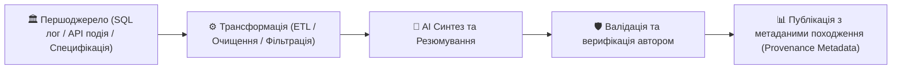

# Урок 117: Відстеження походження інформації (Data Provenance & Lineage)

## 1. Концепція Data Provenance у технічній аналітиці

**Data Provenance (Походження даних / Інформаційний родовід)** — це документально зафіксована хронологія життєвого циклу інформації: від її первинного джерела створення, через усі етапи трансформації, агрегації, перекладу та AI-обробки, аж до фінальної публікації у звіті чи документації.

У сучасному корпоративному середовищі довіра до даних визначається не тим, наскільки красиво вони оформлені, а тим, чи можна **простежити їхній ланцюжок походження (Audit Trail)**.

---

## 2. Структура паспорта походження даних (Provenance Metadata Standard)

Кожен ключовий графік, аналітична таблиця або технічна специфікація повинні супроводжуватися метаданими походження:

| Поле паспорта | Значення | Приклад |
| :--- | :--- | :--- |
| **Source ID (Ідентифікатор)** | Унікальне посилання на першоджерело | `git://repo.internal/telemetry/q3_metrics.parquet#commit=a8f9b2` |
| **Created By (Автор)** | Хто створив або зареєстрував первинні дані | Data Engineering Team / System Sensor 42 |
| **Extraction Date (Дата збору)** | Точний час фіксації даних (UTC) | `2026-09-18T14:30:00Z` |
| **Transformation Pipeline** | Які операції виконувалися над даними | Агрегація середнього за 7 днів, відсікання 99 перцентиля, AI-переклад з англійської |
| **Validation Hash (Хеш-сума)** | Контрольна сума для перевірки цілісності | `SHA-256: e3b0c44298fc1c149afbf4c8996fb92427ae41e4649b934ca495991b7852b855` |

---

## 3. Роль AI у підтримці Data Lineage

Генеративні моделі допомагають автоматизувати ведення інформаційного родоводу:
1. **Автоматична генерація схем Lineage**: створення діаграм потоків даних на основі аналізу коду SQL/Python скриптів.
2. **Анотування артефактів**: збереження промптів, моделей та параметрів температури, які використовувалися для створення кожного абзацу (AI Audit Trail).
3. **Детекція порушень ланцюжка довіри**: виявлення фрагментів звіту, походження яких не підтверджено збереженими логами.
