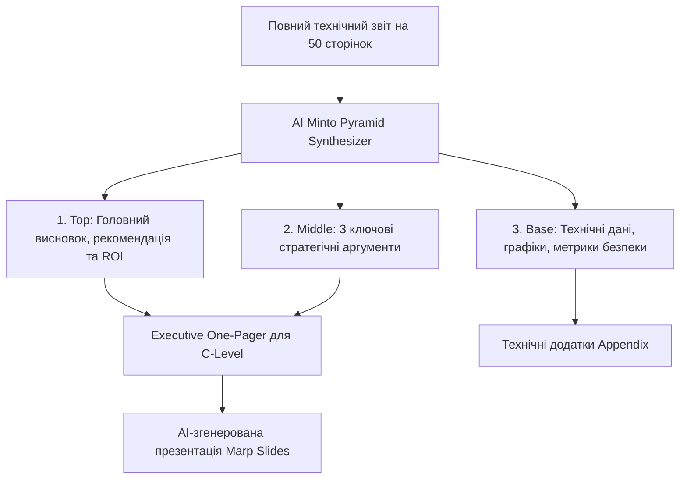
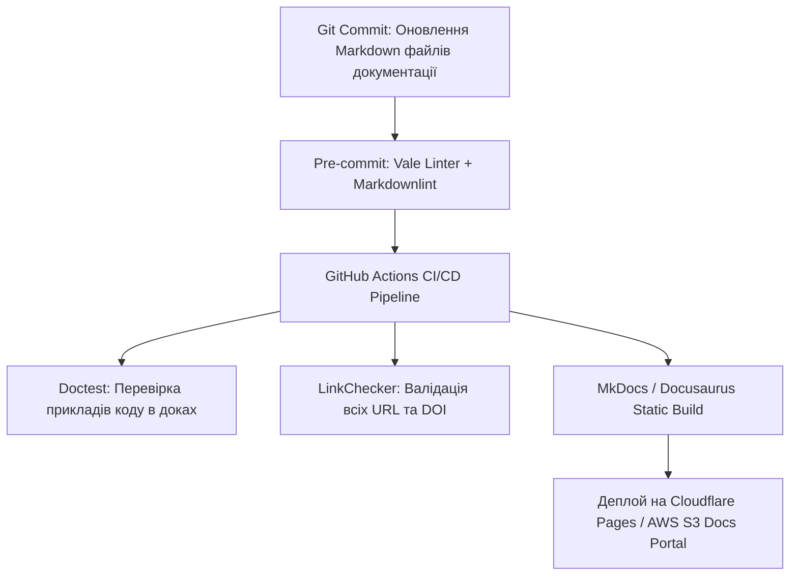

# Урок 117: Підготовка фінального звіту для публікації або презентації

## Вступ та теоретичний фундамент
Фіналізація аналітичного звіту, технічної документації або Whitepaper перед його релізом, публікацією чи презентацією для керівництва (Executive Presentation & Publishing Pipeline) — це комплексний процес, що об'єднує редактуру змісту, візуальну верстку, створення виконавчого резюме (Executive Summary) та перетворення текстового матеріалу у формати мультимедійної доставки (PDF, інтерактивний веб-сайт, слайди презентації).

Нерідко технічні спеціалісти витрачають місяці на глибокі дослідження, але провалюють захист проекту перед топ-менеджментом через відсутність чіткого резюме для керівників (The "TL;DR" Problem) та перевантажені дрібним текстом слайди.

Застосування штучного інтелекту дозволяє автоматизувати фінальну фазу релізу:
1. **Створення Executive Summary (One-Pager)**: Стиснення 50-сторінкового технічного звіту в одну сторінку стратегічних інсайтів, ризиків та фінансових рекомендацій для C-Level стейкхолдерів.
2. **Мультиформатна трансляція контенту (Cross-Format Publishing)**: Автоматичне перетворення Markdown-звіту у структуру слайдів для Marp/Marpit, PDF звіт або інтерактивний лонгрід.
3. **Генерація візуальних резюме та графіків (Infographics & Executive Dashboards)**: Створення коду Mermaid діаграм та SVG-інфографіки.
4. **Передпублікаційний контроль якості (Pre-Flight Checklist & Quality Audit)**: Фінальна перевірка безпеки, відсутності конфіденційної інформації (NDA / PII) та юридичної чистоти.

У цьому уроці ви опануєте інженерні стандарти фіналізації аналітичних звітів, техніку підготовки Executive Summary та автоматизовану генерацію слайдів презентації за допомогою AI.

---

## 1. Архітектурні принципи структуризації Executive Summary за пірамідою Мінто
Презентація складних технічних ініціатив керівництву будується за принципом 'Піраміди Мінто' (The Minto Pyramid Principle): головний висновок та рекомендація повідомляються у першому ж реченні, а технічні аргументи розкриваються нижче.




---

## 2. Методологічний базис: Порівняння форматів публікації технічних звітів
Порівняльний аналіз каналів та форматів фінальної доставки матеріалу.


| Формат публікації | Цільова аудиторія | Ключовий акцент | Інструменти генерації |
| :--- | :--- | :--- | :--- |
| **Executive One-Pager** | CEO, CTO, Інвестори | Бізнес-вплив, фінансові витрати, терміни, ризики | Markdown -> Weasyprint / Typst |
| **Повний технічний Whitepaper** | Інженери, архітектори, технічні партнери | Детальні схеми, код, специфікації, формули | Docusaurus / MkDocs / LaTeX |
| **Slide Deck (Презентація)** | Рада директорів, технічний мітап | Візуальні графіки, мінімум тексту, великі акценти | Marp / Reveal.js / Gamma |
| **Interactive Dashboard** | Продуктові аналітики, Product Managers | Живі фільтри, реальні метрики телеметрії | Streamlit / Observable Framework |

---

## 3. Практичний інженерний регламент: Еталонний код презентації у форматі Marp Markdown
Приклад згенерованого коду інтерактивної презентації для захисту переходу на хмарну інфраструктуру.


```markdown
---
marp: true
theme: gaia
_class: lead
paginate: true
backgroundColor: #f5f5f5
color: #333
---

# Стратегія оптимізації хмарної інфраструктури 2025
### Звіт для Ради Директорів
**Підготував: Lead Research Analyst**

---

## 1. Executive Summary: Головні результати

- **Поточний стан**: Витрати на AWS зросли на 45% за останній рік ($120k/міс).
- **Запропоноване рішення**: Перехід на Kubernetes (EKS) з використанням Spot Instances та відмова від застарілих EC2.
- **Очікуваний бізнес-ефект**:
  - Скорочення витрат на інфраструктуру на **35% ($42,000 щомісяця)**.
  - Підвищення доступності системи (SLA) з 99.5% до **99.95%**.
  - Окупність проекту (ROI): **2.5 місяці**.

---

## 2. Порівняльний аналіз альтернатив

| Параметр | Поточна архітектура | Запропонований EKS | Бездіяльність (через 1 рік) |
| :--- | :--- | :--- | :--- |
| **Щомісячний чек** | $120,000 | **$78,000** | $185,000 |
| **Час відновлення (RTO)**| 45 хвилин | **2 хвилини** | > 2 годин |
| **Трудовитрати DevOps** | 80 год/міс | **20 год/міс** | 160 год/міс |

---

## 3. План впровадження та наступні кроки

1. **Місяць 1**: Створення тестового кластера та бенчмаркінг навантаження.
2. **Місяць 2**: Поетапна міграція 30% некритичних мікросервісів (Canary Rollout).
3. **Місяць 3**: Повний перехід та вимкнення застарілих інстансів.

> **Рішення**: Просимо затвердити бюджет у розмірі $25,000 на проведення міграції.
```

---

## 4. Поглиблений аналіз виробничих кейсів, крайових випадків та антипатернів
Аналіз реальних помилок при захисті технічних звітів.


### Кейс 1: Антипатерн "Стіна тексту на слайді" (The Wall-of-Text Disaster)
- **Проблема**: Інженер скопіював 4 абзаци технічного опису бази даних на слайд і читав його вголос перед керівництвом.
- **Наслідок**: Керівництво втратило увагу на 3-й хвилині, проект фінансування заблокували.
- **Виправлення**: Правило '1 слайд = 1 думка + 1 ключова цифра + графік'.

### Кейс 2: Витік конфіденційних даних клієнтів (PII / API Keys Leak)
- **Проблема**: У додатках до Whitepaper автор навів реальні логи продакшн-сервера з номерами телефонів та токенами доступу.
- **Виправлення**: Обов'язковий автоматизований пре-флайт аудит через `trufflehog` та маскування всіх ідентифікаторів перед релізом.

---

## 5. Покроковий операційний воркфлоу підготовки до релізу звіту
Стандартний алгоритм фіналізації аналітичного проекту.


### Крок 1: Генерація Executive Summary за принципом Мінто
- Викликати AI: `@report.md "Створи Executive Summary на 1 сторінку за принципом Піраміди Мінто: висновок, фінансовий ROI, ризики, рішення"`.

### Крок 2: Генерація презентації у форматі Marp Markdown
- Сконвертувати ключові тези у 5-7 наочних слайдів.

### Крок 3: Проходження чек-листа безпеки та конфіденційності (Pre-Flight Audit)
- Перевірити документ на відсутність чутливих даних клієнтів та API ключів.

### Крок 4: Експорт у фінальні формати (PDF / Slide Deck)
- Виконати: `npx @marp-team/marp-cli presentation.md --pdf -o release.pdf`.

---

## 6. Стратегії підвищення впливу презентації та звітності
1. **Color Contrast & Typography Polish**: Перевірка зручності читання презентації на проекторі при яскравому освітленні.
2. **Dry-Run Rehearsal**: Пробний прогін презентації перед колегами з таймером (не більше 10 хвилин на виступ).
3. **Q&A Defense Sheet**: Підготовка за допомогою AI відповідей на 10 найскладніших та найагресивніших запитань від стейкхолдерів.

---

## 7. Вичерпний чек-лист перевірки та критерії готовності (Definition of Done)
Перед здачею завдань та інтеграцією результатів у виробничу гілку переконайтеся у виконанні наступних критеріїв:

- [ ] **Створено чітке, лаконічне Executive Summary на 1 сторінку за Пірамідою Мінто**
- [ ] **Всі висновки містять фінансові розрахунки, оцінку ROI та терміни окупності**
- [ ] **Створено візуальну презентацію слайдів у форматі Marp / PDF**
- [ ] **Документ пройшов перевірку на відсутність конфіденційних даних (PII, API Keys)**
- [ ] **Всі діаграми та таблиці відображаються коректно з високою контрастністю**
- [ ] **Підготовлено список відповідей на ймовірні критичні запитання стейкхолдерів**
- [ ] **Матеріал звірено на відповідність вихідному технічному завданню**
- [ ] **Фінальний реліз затверджено куратором дослідження та готовий до публікації**

---

## 8. Підсумки, ключові інсайти та розширений глосарій термінів
Опанування цієї теми формує надійний фундамент для щоденної професійної роботи. Системний підхід, формалізовані інженерні стандарти та критичний контроль результатів AI забезпечують високу швидкість та бездоганну надійність кінцевого продукту.

### Глосарій ключових понять
| Термін | Визначення та контекст застосування |
| :--- | :--- |
| **Executive Summary** | Стисле резюме довгого аналітичного звіту для вищого керівництва, що містить ключові висновки та рекомендації. |
| **The Minto Pyramid Principle** | Методологія структуризації ділових комунікацій, при якій головна ідея подається першою, за нею слідують аргументи. |
| **Marp (Markdown Presentation)** | Сучасний інструмент створення стильних слайдів презентацій безпосередньо з тексту розмітки Markdown. |
| **Pre-Flight Checklist** | Фінальний перевірочний список обов'язкових умов перед офіційною публікацією або відправкою матеріалу замовнику. |
| **ROI (Return on Investment)** | Коефіцієнт рентабельності інвестицій, що показує прибутковість або збитковість проекту у відсотках. |
| **Canary Rollout** | Стратегія поступового розгортання нової версії системи для невеликої частки користувачів для мінімізації ризиків. |
| **PII (Personally Identifiable Information)** | Персональні дані, за якими можна прямо чи опосередковано ідентифікувати конкретну особу. |
| **Trufflehog** | Інструмент кібербезпеки для автоматичного пошуку випадково залишених секретів, ключів доступу та паролів у документах і коді. |
| **Dry Run** | Повна репетиція або пробний прогін презентації без реальної аудиторії для відпрацювання таймінгу та відповідей. |
| **Whitepaper** | Офіційний авторитетний поглиблений звіт, що описує складну технічну проблему та пропонує перевірене рішення. |

---

## 9. Поглиблений аналіз архітектури науково-технічної документації та інфодизайну

### 9.1. Методологія структурування складних інженерних Whitepapers
Створення переконливого та академічно бездоганного технічного звіту вимагає дотримання структури IMRaD (Introduction, Methods, Results, and Discussion):
1. **Introduction & Problem Formulation**: Чітке визначення інженерної або наукової проблеми, її фінансовий або операційний вплив на галузь.
2. **Methods & Experimental Setup**: Повний опис методології досліджень, конфігурації тестових стендів, характеристик заліза та версій ПЗ для забезпечення 100% відтворюваності (Reproducibility).
3. **Results & Empirical Data**: Представлення результатів у вигляді стандартизованих графіків (Boxplots, CDF розподіли затримок, теплові карти пам'яті).
4. **Discussion & Threats to Validity**: Чесний аналіз обмежень дослідження, потенційних похибок вимірювання та сфер застосування отриманих висновків.

### 9.2. Автоматизація збірки та версіонування документації (Docs-as-Code Pipeline)



### 9.3. Розширений практичний кейс: Трансляція наукової статті у зрозумілий бізнес-бриф
- **Завдання**: Перетворити 40-сторінкову наукову статтю з криптографії Zero-Knowledge Proofs (ZKP) у 2-сторінковий звіт для інвесторів.
- **Рішення з AI**: Застосування техніки аналогій та видалення абстрактних формул з фокусом на практичному застосуванні: конфіденційність транзакцій, зниження комісій у 100 разів, відповідність банківській таємниці.

---

## 10. Питання для співбесіди та захист технічних текстів (Lead Technical Writer Level)

1. **Як організувати процес рецензування документації інженерами, які постійно зайняті написанням коду?**
   *Еталонна відповідь*: Впровадження концепції Docs-as-Code: документація живе в тому самому репозиторії, що й код, оновлення доків є обов'язковим критерієм приймання (Definition of Done) у Pull Request, а лінтери (Vale) автоматично виправляють стиль, економлячи час інженера.
2. **Як запобігти галюцинаціям мовних моделей при автоматичному створенні описів API?**
   *Еталонна відповідь*: Використання контрактно-орієнтованої генерації (Schema-First). Замість довільного опису коду моделі передається валідна OpenAPI специфікація, а генерація обмежується виключно наявними ендпоінтами та типами даних з обов'язковою валідацією через JSON Schema.
3. **Як виміряти ефективність та якість технічної документації?**
   *Еталонна відповідь*: Метриками самообслуговування (Deflection Rate — зниження кількості звернень до саппорту на 40%), показником CSAT/Helpfulness ('Чи була ця стаття корисною?'), часом онбордингу нових розробників у проєкт та індексами читабельності (Flesch-Kincaid / Gunning fog index).

---

## 11. Практичний регламент версіонування технічної документації та локалізації (i18n)

### 11.1. Стратегії версіонування документації (Versioned Docs Architecture)
При розвитку програмного продукту технічний письменник повинен забезпечувати підтримку документації для різних версій релізів (v1.0, v2.0, Next/Unreleased):
1. **Branch-based vs. Directory-based Versioning**: Використання можливостей генераторів сайтів (Docusaurus versions / MkDocs mike) для одночасного відображення документації для актуальної та застарілих версій API.
2. **Deprecation Warnings**: Чітке позначення застарілих методів та ендпоінтів за допомогою помітних попереджень:
   > ⚠️ **Застаріло (Deprecated in v2.4)**: Цей метод буде вилучено у версії v3.0. Використовуйте новий ендпоінт `POST /api/v2/payments`.
3. **Changelog & Release Notes Automation**: Автоматична генерація списків змін (Conventional Commits -> Release Notes) за допомогою інструментів Release Please / Semantic Release.

### 11.2. Регламент підготовки текстів до локалізації (Internationalization Best Practices)
- **Уникнення культурно-специфічних ідіом**: Пряма, нейтральна мова, що легко перекладається без втрати сенсу.
- **Врахування довжини слів (Text Expansion)**: При перекладі з англійської на українську чи німецьку довжина рядків може збільшуватися на 25-40%, що має бути враховано у дизайні верстки.
- **Формати чисел та дат**: Використання міжнародного стандарту ISO 8601 (`YYYY-MM-DD`) для уникнення плутанини між американським (`MM/DD/YYYY`) та європейським (`DD/MM/YYYY`) форматами.
