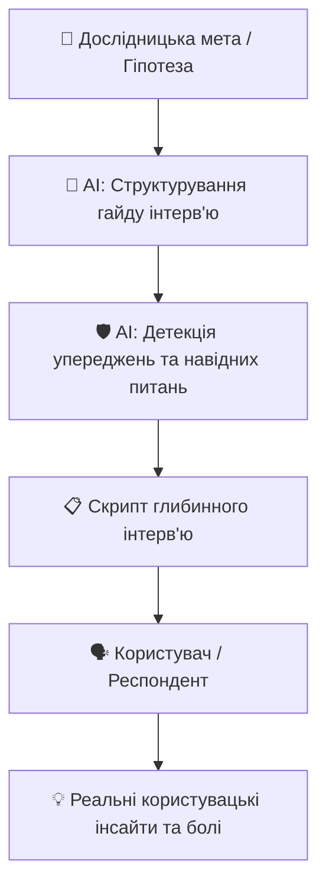

# Урок 106: Підготовка запитань для дослідження

## 1. Роль досліджень у сучасному UI/UX дизайні

Якісний дизайн починається не з малювання пікселів у Figma, а з глибокого розуміння користувача (User Research). Створення цифрових продуктів без дослідження призводить до створення рішень, які не вирішують реальних болей ринку (Product-Market Mismatch).

Основним інструментом якісного дослідження є глибинне інтерв'ю (In-depth User Interview) та опитування (User Survey). Якість отриманих інсайтів на 90% залежить від правильної структури та формулювання запитань.

---

## 2. Методологія складання запитань: The Mom Test та відмова від гіпотетичних питань

Класична помилка початківців — запитувати респондентів про їхні майбутні гіпотетичні дії («Чи користувалися б ви такою функцією?», «Скільки б ви заплатили за цей додаток?»). Люди схильні давати соціально бажані відповіді та переоцінювати свою готовність платити.

### Правило «The Mom Test» (Роб Фіцпатрік):
1. **Говоріть про їхнє реальне минуле життя та досвід**, а не про вашу майбутню ідею.
2. **Запитуйте про конкретні випадки в минулому**: «Розкажіть про останній раз, коли ви стикалися з цією проблемою...»
3. **Менше говоріть, більше слухайте**: відкриті запитання (Open-ended questions), які починаються з «Як?», «Чому?», «Опишіть...».

---

## 3. Використання AI для розробки гайду інтерв'ю

AI-інструменти (Claude 3.5 Sonnet, ChatGPT) кардинально прискорюють підготовку до інтерв'ю, виконуючи такі задачі:
1. **Генерація структури скрипту інтерв'ю**: Вступ (Warm-up), занурення в контекст, дослідження болей, тестування робочих процесів, завершення.
2. **Усунення навідних запитань (Leading Questions)**: AI перевіряє чернетку запитань на нейтральність та неупередженість.
3. **Адаптація під різні сегменти ЦА**: Швидка модифікація гайду під B2B корпоративних клієнтів, кінцевих споживачів (B2C) або вузьких спеціалістів.

### Порівняння запитань:
| Навідне / Слабке запитання (❌) | Нейтральне запитання за підтримки AI (✅) |
| :--- | :--- |
| «Вам подобається наш новий інтерфейс оформлення кошика?» | «Опишіть ваш досвід останньої покупки в нашому сервісі. З якими труднощами ви зіткнулися?» |
| «Чи хотіли б ви мати функцію голосового введення нотаток?» | «Як саме ви фіксуєте швидкі ідеї протягом робочого дня? Що в цьому процесі дратує найбільше?» |
| «Ви б платили 10$ на місяць за аналітику?» | «Якими платними інструментами аналітики ви користуєтеся зараз і як приймали рішення про їх оплату?» |
