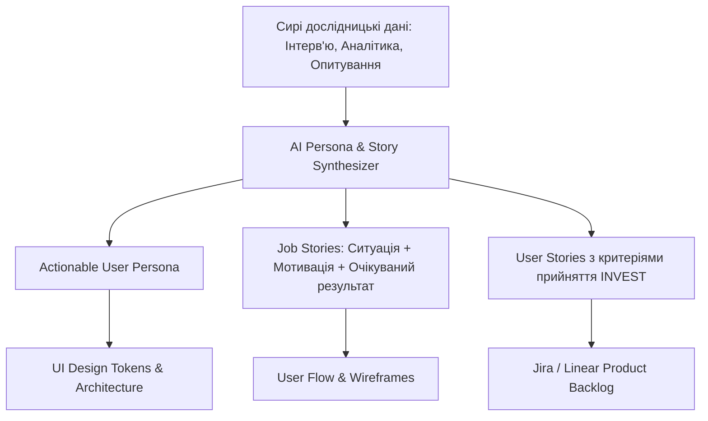
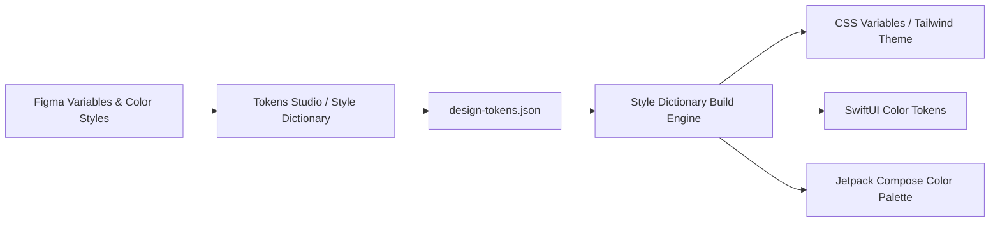

# Урок 106: Формулювання промптів для створення user personas, user stories та job stories

## Вступ та теоретичний фундамент
Проектування цифрових продуктів у сучасну епоху базується на глибокому розумінні психології, мотивації та поведінкових патернів цільової аудиторії (User-Centered Design). Створення деталізованих персон користувачів (User Personas), користувацьких історій (User Stories) та історій робіт (Job Stories / Jobs-to-be-Done Framework) формує фундаментальний міст між бізнес-цілями замовника та реальним інтерфейсним досвідом кінцевого користувача.

Традиційне складання цих артефактів нерідко спиралося на суб'єктивні припущення дизайнерської команди або забирало тижні польових досліджень. Використання генеративних моделей (Claude 3.5/3.7 Sonnet, GPT-4o) революціонізує цей процес:
1. **Синтез емпіричних даних (Empirical Data Synthesis)**: Моделі здатні агрегувати тисячі відгуків, транскриптів інтерв'ю та сесій веб-аналітики у структуровані психографічні профілі.
2. **Фреймворк JTBD (Jobs-to-be-Done Integration)**: Фокусування на життєвих ситуаціях та мотиваціях користувача замість сухих демографічних показників (вік, стать).
3. **Формалізація Acceptance Criteria для розробки**: Перетворення абстрактних історій на чіткі інженерні вимоги за стандартами INVEST та Gherkin.
4. **Усунення когнітивних упереджень (Biases Mitigation)**: AI допомагає виявити маргінальні групи користувачів (Edge Personas) та сценарії доступності (Accessibility & Inclusivity).

У цьому уроці ви опануєте інженерні техніки промптингу для генерації User Personas, User Stories та Job Stories, навчитеся будувати матриці мотивацій та інтегрувати їх у загальний дизайн-пайплайн.

---

## 1. Архітектурні принципи та методологічний базис проектування персонажів
Ефективна персона повинна бути дієвою (Actionable Persona), а не просто художнім описом людини.

### 1.1. Структурні виміри сучасної User Persona
- **Психографічний профіль (Psychographic Core)**: Цінності, психотип, рівень цифрової грамотності, толерантність до складності.
- **Больові точки та бар'єри (Pains & Friction Points)**: Що дратує, лякає або сповільнює користувача в існуючих рішеннях.
- **Цілі та очікувані вигоди (Gains & Core Drivers)**: Чого саме людина хоче досягти у професійному або особистому житті.
- **Контекст використання продукту (Context of Use)**: Пристрої, оточення, обмеження в часі, рівень стресу під час взаємодії.




---

## 2. Методологічний базис: Порівняння User Stories та Job Stories (JTBD)
Порівняльний аналіз методологій опису потреб користувача.


| Критерій порівняння | User Story (Scrum Framework) | Job Story (Jobs-to-be-Done Framework) | Коли обирати |
| :--- | :--- | :--- | :--- |
| **Формула шаблону** | `Як <тип користувача>, я хочу <дію>, щоб <ціль>` | `Коли <ситуація>, я хочу <мотивація>, щоб <вигода>` | User Story — для функцій, Job Story — для контексту |
| **Головний фокус** | Хто виконує дію та яка функція потрібна | Контекст, тригер ситуації та емоційна мотивація | Job Story ідеальна для інноваційних продуктів |
| **Гнучкість рішення** | Часто диктує конкретний інтерфейсний крок | Залишає дизайнеру повну свободу у виборі UI | Job Story запобігає передчасним дизайн-рамкам |
| **Приклад формулювання**| "Як водій, я хочу бачити карту, щоб не заблукати" | "Коли я їду в незнайомому місті під дощем, я хочу чути голосові підказки..." | Для навігаційного UX краще працює Job Story |

---

## 3. Практичний інженерний регламент: Еталонний промпт та артефакт персони
Професійний системний промпт для генерації вичерпного профілю персони та пов'язаних Job Stories для фінтех-додатку.


```markdown
# =====================================================================
# ПРОМПТ ДЛЯ AI: Генерація Actionable User Persona та JTBD матриці
# =====================================================================

Ти — Principal Product Designer та Behavioral UX Researcher.
Створи комплексну дієву персону для нового продукту: "Мобільний банкінг для фрілансерів та IT-підрядників".

Сформуй звіт за наступною структурою:
1. **Профіль**: Архетип, псевдонім, професія, ключові цифрові звички та пристрої.
2. **Jobs-to-be-Done (Core Jobs)**:
   - Functional Job (Основне практичне завдання).
   - Emotional Job (Як користувач хоче себе почувати).
   - Social Job (Як користувач хоче виглядати в очах клієнтів/партнерів).
3. **Pains & Friction Points**: Топ-4 критичні проблеми з існуючими банками.
4. **Gains & Delight Factors**: Чинники, що викличуть захоплення (Aha-момент).
5. **3 ключові Job Stories** у форматі: `Коли [Ситуація/Тригер], я хочу [Мотивація], щоб [Очікуваний результат]`.
6. **Критерії приймання інтерфейсу (UI Design Implications)**: Конкретні рекомендації для UX/UI дизайнера.
```

---

## 4. Поглиблений аналіз виробничих кейсів, крайових випадків та антипатернів
Аналіз поширених дизайнерських помилок при генерації персон.


### Кейс 1: Антипатерн "Картонна персона" (The Generic Persona Trap)
- **Проблема**: AI згенерував стандартний опис: "Олена, 28 років, любить каву, подорожі та зручні сайти".
- **Наслідок**: Жодної практичної користі для інтерфейсу, розробники проігнорували документ.
- **Виправлення**: Застосування фреймворку контекстних обмежень: додавання точних сценаріїв, рівня тривожності під час переказу коштів та вимог до швидкості інтерфейсу при слабкому 3G зв'язку.

### Кейс 2: Пропуск сценаріїв екстремальних користувачів (Edge Personas)
- **Проблема**: Дизайн розроблявся виключно для досвідченого користувача iPhone 15 Pro.
- **Наслідок**: Користувачі зі старими смартфонами та поганим зором не змогли пройти верифікацію документів.
- **Виправлення**: Генерація обов'язкової 'Stress Persona': людина з порушенням зору, яка намагається провести платіж на яскравому сонці з дешевого пристрою.

---

## 5. Покроковий операційний воркфлоу впровадження персон у дизайн-процес
Стандартний алгоритм роботи продуктового дизайнера з AI.


### Крок 1: Збір первинних даних та транскриптів інтерв'ю
- Зібрати нотатки розмов з користувачами та аналітику конверсій воронки.

### Крок 2: Генерація первинних кластерів та JTBD за допомогою Claude
- Завантажити дані та виділити 2-3 ключові архетипи користувачів.

### Крок 3: Формування User Stories з Acceptance Criteria (INVEST)
- Перетворити потреби персон у беклог історій для дизайн-системи.

### Крок 4: Фіксація в Figma та Notion (Design System Guidelines)
- Оформити картку персони у Figma для постійного нагадування команді.

---

## 6. Стратегії валідації та тестування інтерфейсних гіпотез
1. **Continuous Persona Refinement**: Оновлення профілів персон щокварталу на основі реальних продуктових метрик.
2. **INVEST Criteria Validation**: Автоматична перевірка кожної User Story на відповідність стандарту: Independent, Negotiable, Valuable, Estimable, Small, Testable.
3. **Accessibility Matrix**: Перевірка дизайн-рішень на відповідність стандартам WCAG 2.2 AAA.

---

## 7. Вичерпний чек-лист перевірки та критерії готовності (Definition of Done)
Перед здачею завдань та інтеграцією результатів у виробничу гілку переконайтеся у виконанні наступних критеріїв:

- [ ] **Персона містить дієві психографічні характеристики та контекст використання**
- [ ] **Сформульовано функціональні, емоційні та соціальні цілі (JTBD Framework)**
- [ ] **Виділено конкретні больові точки з числовими або часовими метриками**
- [ ] **Job Stories строго слідують шаблону 'Коли... Я хочу... Щоб...'**
- [ ] **User Stories відповідають критеріям INVEST та містять критерії приймання**
- [ ] **Враховано сценарії людей з обмеженими можливостями (WCAG Guidelines)**
- [ ] **Створено картку персони у Figma для постійного використання дизайн-командою**
- [ ] **Вимоги верифіковані з Product Owner та Lead Developer**

---

## 8. Підсумки, ключові інсайти та розширений глосарій термінів
Опанування цієї теми формує надійний фундамент для щоденної професійної роботи. Системний підхід, формалізовані інженерні стандарти та критичний контроль результатів AI забезпечують високу швидкість та бездоганну надійність кінцевого продукту.

### Глосарій ключових понять
| Термін | Визначення та контекст застосування |
| :--- | :--- |
| **User Persona** | Узагальнений напіввигаданий образ ідеального або типового представника цільової аудиторії продукту. |
| **Jobs-to-be-Done (JTBD)** | Теорія інновацій та поведінки клієнтів, яка стверджує, що люди не купують продукти, а 'наймають' їх для виконання певної роботи. |
| **Job Story** | Альтернативний формат опису вимог у JTBD, сфокусований на ситуації, мотивації та очікуваному результаті. |
| **INVEST Criteria** | Набір критеріїв якості користувацької історії: Independent, Negotiable, Valuable, Estimable, Small, Testable. |
| **Aha-Moment** | Момент у користувацькому досвіді, коли людина вперше усвідомлює реальну цінність продукту для свого життя. |
| **Actionable Persona** | Профіль користувача, що містить практичні інсайти, які напряму впливають на дизайн-рішення та архітектуру інтерфейсу. |
| **Cognitive Friction** | Розумовий супротив та напруга, яку відчуває користувач при взаємодії з незрозумілим або заплутаним інтерфейсом. |
| **Edge Persona** | Профіль користувача з нетиповими потребами або обмеженнями, тестування на якому виявляє приховані дефекти UX. |
| **Psychographics** | Класифікація людей за їхніми психологічними характеристиками: цінностями, поглядами, інтересами та способом життя. |
| **WCAG (Web Content Accessibility Guidelines)** | Міжнародні стандарти та настанови щодо забезпечення доступності веб-контенту для людей з інвалідністю. |

---

## 9. Поглиблений аналіз психології сприйняття, дизайн-систем та дизайн-токенів

### 9.1. Математичні та ергономічні закони інтерфейсного проектування
Проектування цифрових інтерфейсів базується на фундаментальних законах психофізики:
1. **Закон Фіттса (Fitts's Law)**: Час досягнення цілі залежить від відстані до неї та її розміру:
   $$T = a + b \cdot \log_2\left(1 + \frac{D}{W}\right)$$
   Розміщення ключових дій (CTA) у кутах екрана або в зоні досяжності великого пальця на мобільних пристроях (Thumb Zone).
2. **Закон близькості та гештальт-психологія (Gestalt Principles)**: Елементи, розташовані близько один до одного, сприймаються мозком як взаємопов'язані. Використання 8-піксельної просторової сітки (8pt Spatial Grid).
3. **Кольоровий контраст та доступність (WCAG 2.2)**: Коефіцієнт контрастності тексту до фону не менше $4.5:1$ для звичайного тексту та $3:1$ для великих заголовків.

### 9.2. Архітектура Design Tokens та синхронізація Figma <-> Code



### 9.3. Розширений практичний кейс: Проектування темної теми (Dark Mode Ergonomics)
- **Проблема**: Проста інверсія кольорів (білий -> чисто чорний `#000000`) викликала сильне зорове напруження та ефект 'розмазування' (OLED Smearing).
- **Виправлення за допомогою AI**: Проектування багатошарової палітри сірих відтінків (`#121212`, `#1E1E1E`, `#2D2D2D`) з регулюванням глибини через піднесення поверхні (Surface Elevation & Elevation Overlay).

---

## 10. Питання для співбесіди та захист дизайн-концепцій (Principal Product Designer Level)

1. **Як ви доводите бізнесу необхідність інвестування у доступність інтерфейсів (Accessibility WCAG AAA)?**
   *Еталонна відповідь*: Доступність — це не лише благодійність, це розширення ринку (+15% користувачів з тимчасовими або постійними обмеженнями зору та моторики), прямий захист від судових позовів за законами ADA/EAA та значне покращення SEO і конверсії для всіх користувачів завдяки чіткій інформаційній структурі.
2. **Як за допомогою AI оптимізувати процес передачі макетів розробникам (Design Handoff)?**
   *Еталонна відповідь*: Використання генерації специфікацій за допомогою мультимодальних моделей: опис станів кнопок (Hover, Active, Focus, Disabled), фіксація точних відступів за дизайн-токенами, автоматичне формування CSS/Swift коду та інтеграція Figma Dev Mode.
3. **Як визначити, що продукт перевантажений когнітивним тертям (Cognitive Friction)?**
   *Еталонна відповідь*: Аналізом поведінкових метрик: високий рівень відмов (Drop-off Rate), довгий час перебування на простих формах (Time on Task), наявність 'Rage Clicks' (хаотичні швидкі кліки) та розбіжність між очікуваннями користувача на карті ментальних моделей і реальним флоу.

---

## 11. Практичний регламент проведення юзабіліті-тестувань та метрики продуктового UX

### 11.1. Стандартизовані кількісні метрики UX (SUS, SUPR-Q, UMUX)
Для перевірки успішності редизайну та валідації нових інтерфейсів використовуються визнані світові шкали:
1. **System Usability Scale (SUS)**: 10 стандартних запитань з 5-бальною шкалою Лайкерта. Цільовий результат для продукту світового рівня — не менше 80.3 балів (Grade A).
2. **Task Completion Rate (TCR)**: Відсоток користувачів, які змогли успішно завершити ключовий сценарій (ціль > 90%).
3. **Time on Task (ToT)**: Середній час, необхідний для досягнення результату (зменшення ToT свідчить про зниження когнітивного навантаження).
4. **Single Ease Question (SEQ)**: Одне запитання після виконання дії: *"Наскільки легко вам було виконати це завдання за шкалою від 1 (дуже важко) до 7 (дуже легко)?"* (ціль > 5.5).

### 11.2. Матриця перевірки доступності інтерфейсів (A11y Audit Checklist)
- **Focus Indicators**: Чітка візуальна рамка фокусу (Outline) товщиною не менше 2px при навігації з клавіатури (Tab navigation).
- **Touch Target Size**: Мінімальний розмір інтерактивних елементів на сенсорних екранах становить $48 \times 48\text{ dp}$ за стандартом Google Material Design або $44 \times 44\text{ pt}$ за Apple HIG.
- **Color Independence**: Інформація про помилку чи статус ніколи не повинна передаватися виключно кольором — обов'язкова наявність іконки або текстового пояснення (для людей з дальтонізмом).
