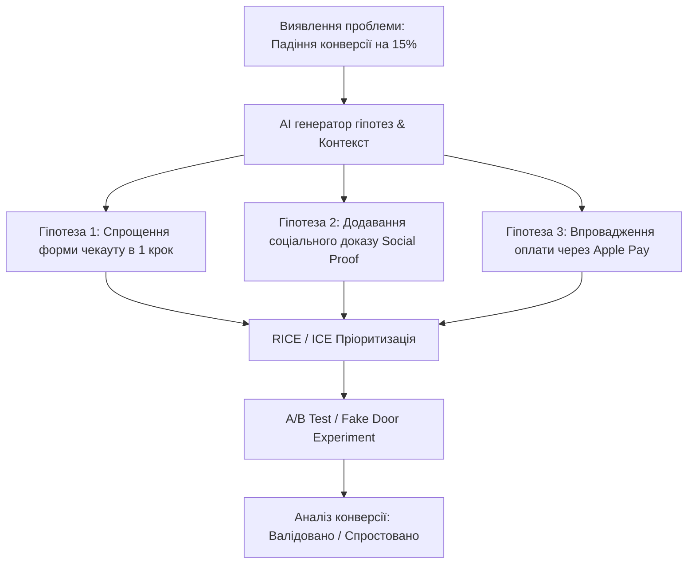
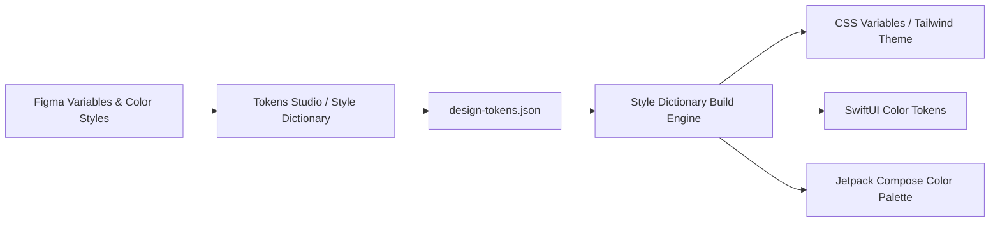

# Урок 107: Генерація та валідація гіпотез щодо потреб користувачів

## Вступ та теоретичний фундамент
Продуктовий дизайн — це наука про безперервне висування, тестування та валідацію поведінкових гіпотез (Hypothesis-Driven Design). Створення будь-якого нового екрана, кнопки чи сценарію взаємодії ґрунтується на гіпотезі: 'Ми віримо, що реалізація рішення X для користувачів Y призведе до бізнес-результату Z через зміну поведінки W'.

Якщо команда реалізує фічі на основі неперевірених здогадок, до 80% витрачених ресурсів розробки виявляються марними (Feature Factory Trap).

Використання штучного інтелекту дозволяє трансформувати висунення та валідацію гіпотез:
1. **Структуризація за науковими продуктовими фреймворками (XYZ & Strategyzer Frameworks)**: Формулювання гіпотез з чіткими кількісними критеріями успіху (Success Signals).
2. **Генерація протилежних контраргументів (Devil's Advocate Prompting)**: AI виступає в ролі критичного аудитора, виявляючи слабкі місця та когнітивні упередження дизайнерів.
3. **Швидкісне проектування експериментів (Low-Cost Prototyping & Smoke Testing)**: Створення плану перевірки гіпотези за допомогою Fake Door тестів, Wizard of Oz або паперових прототипів за 24 години замість 3 місяців кодингу.
4. **Оцінка статистичної значущості та метрик A/B тестування**: Розрахунок розміру вибірки та мінімального відчутного ефекту (MDE).

У цьому уроці детально розглядаються механізми генерування продуктових гіпотез, створення експериментальних інтерфейсних тестів та аналіз отриманих результатів.

---

## 1. Архітектурні принципи та математичні основи Hypothesis-Driven Design
Науковий метод у дизайні інтерфейсів вимагає формулювання гіпотез, які є фальсифікованими (Falsifiable Hypotheses за Карлом Поппером).

### 1.1. Канонічна формула продуктової гіпотези
`Ми віримо, що [Рішення/Інтерфейсна зміна] для [Цільової аудиторії] вирішить [Больову точку] та призведе до [Зміна метрики], і ми дізнаємося про успіх, коли побачимо [Кількісний сигнал успіху].`




---

## 2. Методологічний базис: Порівняння фреймворків валідації гіпотез
Порівняння методів тестування інтерфейсних гіпотез за вартістю та достовірністю.


| Метод тестування | Трудомісткість | Швидкість отримання результату | Достовірність даних |
| :--- | :--- | :--- | :--- |
| **Fake Door Test (404 Page)** | Мінімальна (1 лендінг / банер) | 24-48 годин | Висока (фіксує реальний клік користувача) |
| **Wizard of Oz Prototype** | Середня (ручна обробка бекенду) | 3-5 днів | Дуже висока (імітує повну роботу AI/системи) |
| **User Testing на прототипі** | Середня (Figma + 5 інтерв'ю) | 2-3 дні | Висока для UX-бар'єрів, середня для готовності платити |
| **Повноцінний A/B Test** | Висока (розробка коду обох гілок) | 2-4 тижні | Максимальна (статистично значущі транзакції) |

---

## 3. Практичний інженерний регламент: Еталонний промпт для валідації та стрес-тесту гіпотез
Професійний промпт для генерації та критичного аналізу дизайн-гіпотез.


```markdown
# =====================================================================
# ПРОМПТ ДЛЯ AI: Генерація, пріоритизація та стрес-тест продуктових гіпотез
# =====================================================================

Ти — VP of Product Management та Head of Growth Design.
Контекст: SaaS платформа для управління проектами. 65% нових користувачів не завершують онбординг і закривають вкладку на етапі створення першої задачі.

Виконай комплексний аналіз:
1. Згенеруй 4 альтернативні гіпотези для усунення цього бар'єру (формат: Ми віримо... Для... Це призведе до... Ми виміряємо через...).
2. Оціни кожну гіпотезу за фреймворком ICE (Impact: 1-10, Confidence: 1-10, Ease: 1-10) та порахуй підсумковий бал.
3. Проведи режим "Адвокат Диявола" (Devil's Advocate): для топ-1 гіпотези опиши 3 причини, чому цей експеримент може з тріском провалитися.
4. Розроби план найдешевшого експерименту (Fake Door / Low-fi Prototype), який можна запустити за 48 годин для підтвердження інтересу.
```

---

## 4. Поглиблений аналіз виробничих кейсів, крайових випадків та антипатернів
Розглянемо практичні помилки продуктових команд при тестуванні гіпотез.


### Кейс 1: Антипатерн "Підтверджувальне упередження" (Confirmation Bias Trap)
- **Проблема**: Команда провела інтерв'ю з 5 друзями фаундера, які сказали "це чудовий додаток". Команда вклала $50k у розробку, але в продакшені ніхто не купив підписку.
- **Виправлення**: Завжди тестувати готовність платити реальними діями (Skin in the Game): введення пошти, передоплата $1 або клік на кнопку 'Купити' (Fake Door), а не абстрактними запитаннями 'Чи користувалися б ви?'.

### Кейс 2: Передчасне зупинення A/B тесту (Peeking Problem)
- **Проблема**: Дизайнер побачив приріст конверсії +25% на другий день тесту і зупинив експеримент. Через місяць конверсія впала.
- **Виправлення**: Застосування суворого розрахунку статистичної значущості ($p < 0.05$) та витримка повного бізнес-циклу (мінімум 14 днів для врахування поведінки у вихідні дні).

---

## 5. Покроковий операційний воркфлоу тестування гіпотез
Порядок дій продуктового дизайнера.


### Крок 1: Ідентифікація проблеми в аналітиці (Mixpanel / Amplitude)
- Знайти екран з найбільшим відтоком користувачів (Drop-off Rate).

### Крок 2: Генерація гіпотез та пріоритизація RICE з AI
- Скласти список із 5-7 рішень та обрати лідера.

### Крок 3: Створення швидкого прототипу у Figma (Low-fi Prototype)
- Зібрати інтерактивний клікабельний макет за 2 години.

### Крок 4: Запуск експерименту та збір даних
- Провести 5 юзабіліті-тестів або запустити спліт-тест.

### Крок 5: Прийняття рішення (Pivot, Persevere, or Kill)
- Якщо гіпотеза підтверджена — передавати у повноцінну розробку. Якщо ні — зафіксувати знання у базі уроків.

---

## 6. Стратегії підвищення точності продуктових досліджень
1. **Skin in the Game Metrics**: Використання метрик, що вимагають зусиль від користувача (час, гроші, соціальний капітал), замість усних схвалень.
2. **Triangulation of Data**: Поєднання якісних досліджень (глибинні інтерв'ю) з кількісними даними (веб-аналітика).
3. **Hypothesis Repository**: Централізований облік усіх перевірених гіпотез у Notion для уникнення повторних помилок новими співробітниками.

---

## 7. Вичерпний чек-лист перевірки та критерії готовності (Definition of Done)
Перед здачею завдань та інтеграцією результатів у виробничу гілку переконайтеся у виконанні наступних критеріїв:

- [ ] **Гіпотеза сформульована за науковим канонічним шаблоном і є фальсифікованою**
- [ ] **Визначено конкретні кількісні сигнали успіху (Success Metrics & MDE)**
- [ ] **Проведено пріоритизацію за фреймворком RICE або ICE**
- [ ] **Проведено критичний стрес-тест у режимі 'Адвокат Диявола'**
- [ ] **Обрано найдешевший метод первинної валідації (Fake Door / Low-fi Test)**
- [ ] **Враховано статистичну значущість та мінімальний розмір вибірки для тесту**
- [ ] **Результати експерименту зафіксовано у корпоративному репозиторії знань**
- [ ] **Прийнято обґрунтоване рішення щодо передачі фічі в розробку (Go / No-Go)**

---

## 8. Підсумки, ключові інсайти та розширений глосарій термінів
Опанування цієї теми формує надійний фундамент для щоденної професійної роботи. Системний підхід, формалізовані інженерні стандарти та критичний контроль результатів AI забезпечують високу швидкість та бездоганну надійність кінцевого продукту.

### Глосарій ключових понять
| Термін | Визначення та контекст застосування |
| :--- | :--- |
| **Hypothesis-Driven Design** | Методологія створення інтерфейсів, при якій кожне дизайнерське рішення розглядається як перевірювана експериментом гіпотеза. |
| **Fake Door Test** | Метод тестування попиту на неіснуючу фічу за допомогою розміщення кнопки/банера, що веде на повідомлення про розробку. |
| **Wizard of Oz** | Метод прототипування, при якому користувач вважає, що працює з автоматичною системою, але процеси вручну виконує людина. |
| **ICE Scoring** | Фреймворк пріоритизації ідей за трьома параметрами: Impact (вплив), Confidence (впевненість), Ease (простота). |
| **RICE Scoring** | Розширений фреймворк пріоритизації: Reach (охоплення), Impact, Confidence, Effort (зусилля). |
| **Confirmation Bias** | Психологічна схильність людини шукати та інтерпретувати інформацію так, щоб підтвердити свої початкові переконання. |
| **Statistical Significance (p-value)** | Ймовірність того, що отриманий результат експерименту є випадковим коливанням, а не наслідком змін. |
| **Minimum Detectable Effect (MDE)** | Мінімальна відносна зміна ключової метрики, яку здатний достовірно зафіксувати запланований A/B тест. |
| **Drop-off Rate** | Відсоток користувачів, які покинули воронку конверсії на певному проміжному кроці. |
| **Skin in the Game** | Концепція, згідно з якою користувач повинен ризикувати власними ресурсами (грошима, репутацією, часом) для підтвердження намірів. |

---

## 9. Поглиблений аналіз психології сприйняття, дизайн-систем та дизайн-токенів

### 9.1. Математичні та ергономічні закони інтерфейсного проектування
Проектування цифрових інтерфейсів базується на фундаментальних законах психофізики:
1. **Закон Фіттса (Fitts's Law)**: Час досягнення цілі залежить від відстані до неї та її розміру:
   $$T = a + b \cdot \log_2\left(1 + \frac{D}{W}\right)$$
   Розміщення ключових дій (CTA) у кутах екрана або в зоні досяжності великого пальця на мобільних пристроях (Thumb Zone).
2. **Закон близькості та гештальт-психологія (Gestalt Principles)**: Елементи, розташовані близько один до одного, сприймаються мозком як взаємопов'язані. Використання 8-піксельної просторової сітки (8pt Spatial Grid).
3. **Кольоровий контраст та доступність (WCAG 2.2)**: Коефіцієнт контрастності тексту до фону не менше $4.5:1$ для звичайного тексту та $3:1$ для великих заголовків.

### 9.2. Архітектура Design Tokens та синхронізація Figma <-> Code



### 9.3. Розширений практичний кейс: Проектування темної теми (Dark Mode Ergonomics)
- **Проблема**: Проста інверсія кольорів (білий -> чисто чорний `#000000`) викликала сильне зорове напруження та ефект 'розмазування' (OLED Smearing).
- **Виправлення за допомогою AI**: Проектування багатошарової палітри сірих відтінків (`#121212`, `#1E1E1E`, `#2D2D2D`) з регулюванням глибини через піднесення поверхні (Surface Elevation & Elevation Overlay).

---

## 10. Питання для співбесіди та захист дизайн-концепцій (Principal Product Designer Level)

1. **Як ви доводите бізнесу необхідність інвестування у доступність інтерфейсів (Accessibility WCAG AAA)?**
   *Еталонна відповідь*: Доступність — це не лише благодійність, це розширення ринку (+15% користувачів з тимчасовими або постійними обмеженнями зору та моторики), прямий захист від судових позовів за законами ADA/EAA та значне покращення SEO і конверсії для всіх користувачів завдяки чіткій інформаційній структурі.
2. **Як за допомогою AI оптимізувати процес передачі макетів розробникам (Design Handoff)?**
   *Еталонна відповідь*: Використання генерації специфікацій за допомогою мультимодальних моделей: опис станів кнопок (Hover, Active, Focus, Disabled), фіксація точних відступів за дизайн-токенами, автоматичне формування CSS/Swift коду та інтеграція Figma Dev Mode.
3. **Як визначити, що продукт перевантажений когнітивним тертям (Cognitive Friction)?**
   *Еталонна відповідь*: Аналізом поведінкових метрик: високий рівень відмов (Drop-off Rate), довгий час перебування на простих формах (Time on Task), наявність 'Rage Clicks' (хаотичні швидкі кліки) та розбіжність між очікуваннями користувача на карті ментальних моделей і реальним флоу.

---

## 11. Практичний регламент проведення юзабіліті-тестувань та метрики продуктового UX

### 11.1. Стандартизовані кількісні метрики UX (SUS, SUPR-Q, UMUX)
Для перевірки успішності редизайну та валідації нових інтерфейсів використовуються визнані світові шкали:
1. **System Usability Scale (SUS)**: 10 стандартних запитань з 5-бальною шкалою Лайкерта. Цільовий результат для продукту світового рівня — не менше 80.3 балів (Grade A).
2. **Task Completion Rate (TCR)**: Відсоток користувачів, які змогли успішно завершити ключовий сценарій (ціль > 90%).
3. **Time on Task (ToT)**: Середній час, необхідний для досягнення результату (зменшення ToT свідчить про зниження когнітивного навантаження).
4. **Single Ease Question (SEQ)**: Одне запитання після виконання дії: *"Наскільки легко вам було виконати це завдання за шкалою від 1 (дуже важко) до 7 (дуже легко)?"* (ціль > 5.5).

### 11.2. Матриця перевірки доступності інтерфейсів (A11y Audit Checklist)
- **Focus Indicators**: Чітка візуальна рамка фокусу (Outline) товщиною не менше 2px при навігації з клавіатури (Tab navigation).
- **Touch Target Size**: Мінімальний розмір інтерактивних елементів на сенсорних екранах становить $48 \times 48\text{ dp}$ за стандартом Google Material Design або $44 \times 44\text{ pt}$ за Apple HIG.
- **Color Independence**: Інформація про помилку чи статус ніколи не повинна передаватися виключно кольором — обов'язкова наявність іконки або текстового пояснення (для людей з дальтонізмом).
