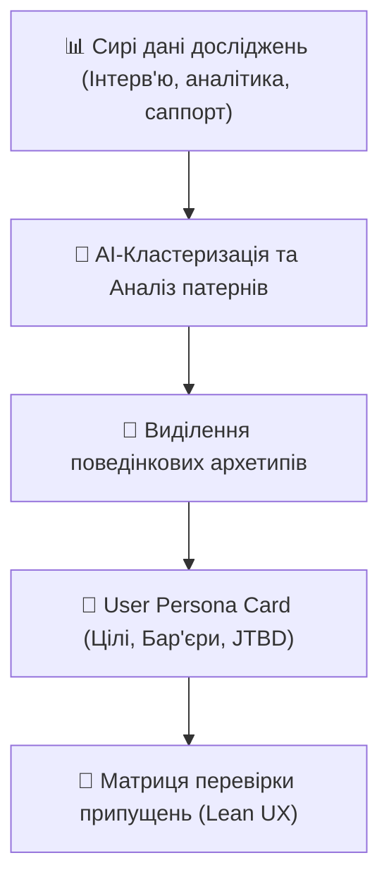

# Урок 107: Формування портретів користувачів та перевірка припущень

## 1. Від вигаданих персонажів (Proto-Personas) до Data-Driven портретів

У класичному дизайні створення персон часто перетворювалося на формальність: дизайнери вигадували вік, фотографію з фотостоку та випадкові хобі («Олена, 28 років, любить каву та йогу»), які не мали жодного відношення до взаємодії з продуктом.

Сучасний **Data-Driven Persona** підхід базується на:
- Реальних поведінкових патернах (Behavioral Archetypes).
- Мотиваціях та драйверах прийняття рішень (Jobs to be Done).
- Ментальних моделях та технічній грамотності (Tech Literacy).
- Больових точках та бар'єрах (Friction Points).

---

## 2. Структура професійної картки UX-персони

| Блок картки | Що містить | Приклад |
| :--- | :--- | :--- |
| **Архетип та роль** | Посада, контекст використання продукту | «Оксана — Головний бухгалтер невеликого підприємства» |
| **Основна робота (JTBD)** | Що користувач намагається досягти | «Коли приходить кінець кварталу, я хочу закрити звіт за 2 години без помилок у податковій» |
| **Болі та страхи (Pains)** | Що викликає стрес та забирає час | «Страх отримати штраф через зміну форми звітності; заплутаний імпорт банківських виписок» |
| **Ментальна модель** | Як користувач уявляє собі роботу системи | «Очікує інтерфейс, схожий на таблицю Excel з гарячими клавішами, а не мобільний свайп» |
| **Драйвери переходу** | Що змусить змінити звичний інструмент | «Гарантія повної відповідності законодавству та підтримка бухгалтера телефоном» |

---

## 3. Lean UX Canvas: Формулювання та перевірка припущень

Перед тим як малювати інтерфейс, продуктова команда формує гіпотези у форматі Lean UX:

> **Формула гіпотези:**
> «Ми віримо, що **[створення функції X]**
> для **[сегменту користувачів Y]**
> допоможе досягти **[бізнес-результату Z]**.
> Ми зрозуміємо, що це спрацювало, коли побачимо **[кількісну або якісну метрику M]**».

AI допомагає ранжувати гіпотези на **Матриці ризиків (Assumptions Risk Matrix)** за двома осями:
1. Рівень невизначеності (High/Low Uncertainty).
2. Критичність для виживання продукту (High/Low Impact).
