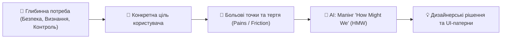

# Урок 108: Визначення потреб, цілей і проблем користувача

## 1. Тріада дослідника: Потреби (Needs), Цілі (Goals) та Болі (Pains)

Користувацький досвід будується на чіткому розмежуванні понять:
1. **Потреба (Need)**: Фундаментальна вимога або дефіцит ресурсу (наприклад, «потреба відчувати фінансову безпеку»).
2. **Ціль (Goal)**: Конкретний бажаний кінцевий стан (наприклад, «мати резервний фонд на 3 місяці життя»).
3. **Біль (Pain / Friction Point)**: Перешкода, затримка, страх чи незручність на шляху до досягнення цілі (наприклад, «незрозуміло, скільки грошей можна витратити сьогодні без шкоди для заощаджень»).

---

## 2. Фреймворк «How Might We» (HMW) для генерації рішень

Методика **HMW (Як ми можемо...)** перетворює виявлені болі та бар'єри користувача на конструктивні дизайнерські виклики для брейнштормінгу.

### Алгоритм перетворення:
- **Проблема / Біль**: «Користувачі кидають заповнення довгої форми заявки на кредит на 3-му кроці, бо не знають, скільки ще полів залишилося».
- **HMW питання від AI**:
  - *«Як ми можемо показати користувачу його прогрес та винагородити за кожен заповнений крок?»*
  - *«Як ми можемо автоматично заповнити 80% полів через BankID / Дію?»*
  - *«Як ми можемо дозволити користувачу зберегти чернетку та продовжити пізніше з мобільного?»*

---

## 3. Мапінг болей користувача за шкалою інтенсивності

| Тип болю | Рівень критичності | Що відчуває користувач | Приклад у цифровому продукті |
| :--- | :--- | :--- | :--- |
| **Блокуючий (Blocker)** | 🔴 Критичний | Неможливість завершити цільову дію (Drop-off) | Не приходить SMS-код підтвердження або кнопка «Оплатити» не реагує на клік. |
| **Фруструючий (Frustration)** | 🟡 Середній | Дія виконується, але з надмірними зусиллями | Необхідність повторно вводити номер картки при кожній покупці. |
| **Косметичний (Nuisance)** | 🟢 Низький | Дрібна незручність, яка не зупиняє процес | Неоптимальний шрифт або занадто яскравий банер підказок. |
