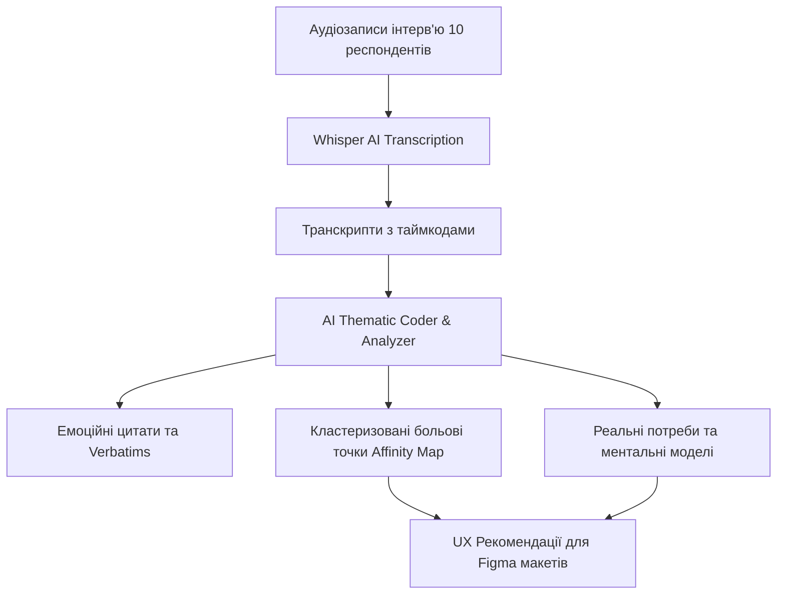
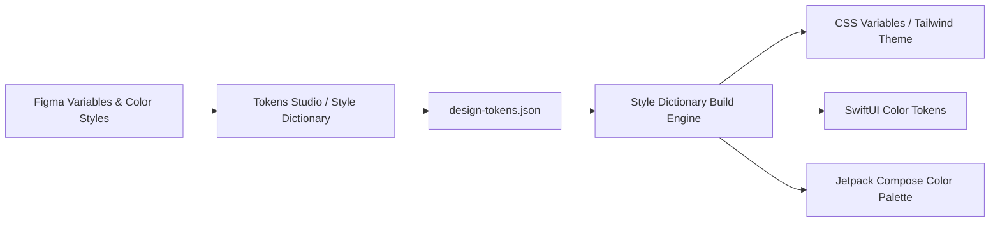

# Урок 108: Побудова структури інтерв’ю та аналіз відповідей за допомогою AI

## Вступ та теоретичний фундамент
Якісні користувацькі дослідження (Qualitative User Research) та глибинні інтерв'ю (In-Depth CustDev Interviews) є золотим джерелом інсайтів про невисловлені потреби, приховані мотивації та ментальні моделі користувачів. Проте проведення інтерв'ю та наступний аналіз десятків годин аудіозаписів є надзвичайно ресурсомістким завданням, схильним до суб'єктивізму дослідника.

Застосування LLM забезпечує прорив у швидкості та якості польових досліджень:
1. **Проектування безсторонніх гайдів для інтерв'ю (Non-Biased Interview Guides)**: Генерація відкритих запитань за методологією 'Спитай маму' (The Mom Test Роберта Фітцпатріка), що виключають навідні формулювання.
2. **Автоматична транскрибація та виділення інсайтів (Whisper + Claude Processing)**: Перетворення мовлення на текст та миттєва екстракція ключових цитат, больових точок і тригерів покупки.
3. **Тематичне кодування та кластеризація (Thematic Coding & Affinity Mapping)**: Автоматичне тегування відповідей за семантичними категоріями.
4. **Виявлення ментальних моделей (Mental Models Extraction)**: Зіставлення того, як користувач уявляє собі роботу системи, з реальною архітектурою продукту.

У цьому уроці ви опануєте інструментарій побудови гайдів для інтерв'ю та навчитеся використовувати AI для аналізу масивів інтерв'ю з візуалізацією інсайтів.

---

## 1. Архітектурні принципи побудови недирективного інтерв'ю
Головний принцип якісного дослідження: **ніколи не питати користувача про майбутнє чи його думку про ідею**. Слід досліджувати виключно реальний минулий досвід та фактичні дії.




---

## 2. Методологічний базис: Порівняння запитань за принципом The Mom Test
Порівняння небезпечних навідних запитань та еталонних запитань на базі The Mom Test.


| Невдале навідне запитання (Biased) | Чому це помилка | Еталонне запитання (The Mom Test) | Що реально з'ясовуємо |
| :--- | :--- | :--- | :--- |
| "Вам подобається наша ідея розумного списку покупок?" | Людина бреше зі ввічливості | "Як саме ви складаєте список покупок зараз? Покажіть останній." | Реальний існуючий процес та звички |
| "Ви б заплатили \$10 за такий сервіс?" | Гіпотетичні гроші нічого не варті | "Скільки ви витратили минулого місяця на вирішення цієї проблеми?" | Реальна готовність платити за рішення |
| "Чи була б вам корисна кнопка автозамовлення?" | Людина завжди скаже 'так' на будь-яку кнопку | "Коли востаннє ви забули купити товар і що ви тоді зробили?" | Гострота проблеми та наслідки збою |
| "Які ще функції нам додати?" | Перекладає проектування на респондента | "Яка найскладніша річ у поточному процесі і чому?" | Справжня больова точка для інновації |

---

## 3. Практичний інженерний регламент: Промпт для тематичного аналізу транскриптів
Професійний системний промпт для синтезу 10 транскриптів інтерв'ю у структуровану карту спорідненості (Affinity Diagram).


```markdown
# =====================================================================
# ПРОМПТ ДЛЯ AI: Синтез транскриптів інтерв'ю та виділення інсайтів
# =====================================================================

Ти — Lead UX Researcher з 12-річним досвідом у якісних дослідженнях.
Ось транскрипти 5 інтерв'ю з користувачами нашого сервісу доставки їжі:
[ВСТАВИТИ ТЕКСТИ ТРАНСКРИПТІВ]

Виконай комплексне тематичне кодування:
1. **Affinity Diagram Clusters**: Об'єднай висловлювання респондентів у 4-5 семантичних кластерів (наприклад: Непрозорість ціни, Тривога за час кур'єра, Складність вибору).
2. **Top Pains (Больові точки)**: Для кожної проблеми вкажи частоту згадування (N з 5 респондентів) та рівень гостроти (High/Medium/Low).
3. **Golden Quotes (Verbatims)**: Виділи 3 найяскравіші прямі цитати користувачів, що ілюструють емоційний бар'єр.
4. **Mental Model Gaps**: Де уявлення користувача про процес розходиться з реальним інтерфейсом додатку?
5. **Actionable UX Recommendations**: 5 конкретних змін в UI для усунення виявлених проблем.
```

---

## 4. Поглиблений аналіз виробничих кейсів, крайових випадків та антипатернів
Аналіз типових помилок при аналізі інтерв'ю.


### Кейс 1: Антипатерн "Голос найгучнішого респондента" (The Loudest Voice Fallacy)
- **Проблема**: Один агресивний респондент 40 хвилин вимагав додати темну тему. Дизайнери кинули всі сили на темну тему, хоча інші 9 користувачів страждали від неможливості оплатити замовлення через Apple Pay.
- **Виправлення**: Застосування обов'язкової кількісної матриці частотності згадувань у промпті AI: сортування проблем за кількістю респондентів, які з ними зіткнулися.

### Кейс 2: Втрата контексту емоційного тону при текстовій транскрибації
- **Проблема**: Респондент сказав 'Ну так, дуже зручно' з сарказмом і важким зітханням. AI текстово інтерпретував це як позитивний відгук.
- **Виправлення**: Фіксація невербальних сигналів та використання мультимодальних моделей з аналізом аудіотону (Audio-Native LLM).

---

## 5. Покроковий операційний воркфлоу проведення UX-дослідження
Стандартна операційна процедура UX дослідника.


### Крок 1: Генерація гайду інтерв'ю за принципом The Mom Test
- Скласти 10 відкритих запитань без навідних конструкцій за допомогою Claude.

### Крок 2: Проведення 5-8 глибинних інтерв'ю (CustDev)
- Записати сесії з респондентами у Zoom / Google Meet.

### Крок 3: Автоматична транскрибація через OpenAI Whisper
- Отримати текстові файли з таймкодами та розділенням спікерів (Diarization).

### Крок 4: Запуск AI для побудови Affinity Map
- Згенерувати звіт з інсайтами та рекомендаціями.

### Крок 5: Презентація результатів команді у FigJam / Miro
- Створити інтерактивну дошку з цитатами для дизайн-спринту.

---

## 6. Стратегії підвищення надійності дослідницьких даних
1. **Speaker Diarization**: Точне розділення реплік інтерв'юера та респондента для запобігання змішування слів.
2. **Blind Dual-Coding**: Незалежне кодування транскриптів двома дослідниками (або AI + людина) для перевірки збігу інсайтів (Inter-Rater Reliability).
3. **Continuous Discovery Habits**: Проведення мінімум 2 інтерв'ю з користувачами щотижня на постійній основі (за методологією Терези Торрес).

---

## 7. Вичерпний чек-лист перевірки та критерії готовності (Definition of Done)
Перед здачею завдань та інтеграцією результатів у виробничу гілку переконайтеся у виконанні наступних критеріїв:

- [ ] **Гайд інтерв'ю містить виключно відкриті запитання за методологією The Mom Test**
- [ ] **Повністю відсутні навідні запитання та запитання про гіпотетичне майбутнє**
- [ ] **Всі аудіозаписи транскрибовані з точним розділенням спікерів (Diarization)**
- [ ] **Проведено тематичне кодування та кластеризацію у форматі Affinity Diagram**
- [ ] **Виділено прямі емоційні цитати користувачів для кожної больової точки**
- [ ] **Підраховано частоту згадування проблем серед усіх респондентів**
- [ ] **Сформовано конкретні та перевірювані рекомендації для інтерфейсу**
- [ ] **Звіт презентовано команді продукту та збережено у базі знань**

---

## 8. Підсумки, ключові інсайти та розширений глосарій термінів
Опанування цієї теми формує надійний фундамент для щоденної професійної роботи. Системний підхід, формалізовані інженерні стандарти та критичний контроль результатів AI забезпечують високу швидкість та бездоганну надійність кінцевого продукту.

### Глосарій ключових понять
| Термін | Визначення та контекст застосування |
| :--- | :--- |
| **Qualitative UX Research** | Дослідження користувацького досвіду, спрямоване на з'ясування причин, мотивацій та ментальних моделей поведінки людей. |
| **The Mom Test** | Методологія формулювання запитань для інтерв'ю, при якій навіть власна мама не зможе збрехати вам про ваш продукт. |
| **Affinity Diagram (Affinity Mapping)** | Метод групування великої кількості якісних даних, думок та інсайтів за природною семантичною схожістю. |
| **Thematic Coding** | Процес якісного аналізу тексту шляхом присвоєння категоріальних міток (кодів) окремим фрагментам для виявлення закономірностей. |
| **Speaker Diarization** | Технологія розпізнавання мовлення, що автоматично ідентифікує, хто саме говорив кожну репліку в аудіозаписі. |
| **Mental Model** | Уявлення та очікування користувача про те, як працює система у реальному світі на основі його попереднього життєвого досвіду. |
| **Continuous Discovery** | Підхід до безперервного регулярного дослідження потреб користувачів невеликими ітераціями щотижня. |
| **Inter-Rater Reliability** | Ступінь узгодженості оцінок та висновків, зроблених різними незалежними дослідниками на одному й тому самому матеріалі. |
| **Verbatim** | Дослівний текстовий запис або цитата слів респондента без змін та редагування. |
| **CustDev (Customer Development)** | Методологія створення продуктів через постійне тестування ідей на реальних потенційних клієнтах. |

---

## 9. Поглиблений аналіз психології сприйняття, дизайн-систем та дизайн-токенів

### 9.1. Математичні та ергономічні закони інтерфейсного проектування
Проектування цифрових інтерфейсів базується на фундаментальних законах психофізики:
1. **Закон Фіттса (Fitts's Law)**: Час досягнення цілі залежить від відстані до неї та її розміру:
   $$T = a + b \cdot \log_2\left(1 + \frac{D}{W}\right)$$
   Розміщення ключових дій (CTA) у кутах екрана або в зоні досяжності великого пальця на мобільних пристроях (Thumb Zone).
2. **Закон близькості та гештальт-психологія (Gestalt Principles)**: Елементи, розташовані близько один до одного, сприймаються мозком як взаємопов'язані. Використання 8-піксельної просторової сітки (8pt Spatial Grid).
3. **Кольоровий контраст та доступність (WCAG 2.2)**: Коефіцієнт контрастності тексту до фону не менше $4.5:1$ для звичайного тексту та $3:1$ для великих заголовків.

### 9.2. Архітектура Design Tokens та синхронізація Figma <-> Code



### 9.3. Розширений практичний кейс: Проектування темної теми (Dark Mode Ergonomics)
- **Проблема**: Проста інверсія кольорів (білий -> чисто чорний `#000000`) викликала сильне зорове напруження та ефект 'розмазування' (OLED Smearing).
- **Виправлення за допомогою AI**: Проектування багатошарової палітри сірих відтінків (`#121212`, `#1E1E1E`, `#2D2D2D`) з регулюванням глибини через піднесення поверхні (Surface Elevation & Elevation Overlay).

---

## 10. Питання для співбесіди та захист дизайн-концепцій (Principal Product Designer Level)

1. **Як ви доводите бізнесу необхідність інвестування у доступність інтерфейсів (Accessibility WCAG AAA)?**
   *Еталонна відповідь*: Доступність — це не лише благодійність, це розширення ринку (+15% користувачів з тимчасовими або постійними обмеженнями зору та моторики), прямий захист від судових позовів за законами ADA/EAA та значне покращення SEO і конверсії для всіх користувачів завдяки чіткій інформаційній структурі.
2. **Як за допомогою AI оптимізувати процес передачі макетів розробникам (Design Handoff)?**
   *Еталонна відповідь*: Використання генерації специфікацій за допомогою мультимодальних моделей: опис станів кнопок (Hover, Active, Focus, Disabled), фіксація точних відступів за дизайн-токенами, автоматичне формування CSS/Swift коду та інтеграція Figma Dev Mode.
3. **Як визначити, що продукт перевантажений когнітивним тертям (Cognitive Friction)?**
   *Еталонна відповідь*: Аналізом поведінкових метрик: високий рівень відмов (Drop-off Rate), довгий час перебування на простих формах (Time on Task), наявність 'Rage Clicks' (хаотичні швидкі кліки) та розбіжність між очікуваннями користувача на карті ментальних моделей і реальним флоу.

---

## 11. Практичний регламент проведення юзабіліті-тестувань та метрики продуктового UX

### 11.1. Стандартизовані кількісні метрики UX (SUS, SUPR-Q, UMUX)
Для перевірки успішності редизайну та валідації нових інтерфейсів використовуються визнані світові шкали:
1. **System Usability Scale (SUS)**: 10 стандартних запитань з 5-бальною шкалою Лайкерта. Цільовий результат для продукту світового рівня — не менше 80.3 балів (Grade A).
2. **Task Completion Rate (TCR)**: Відсоток користувачів, які змогли успішно завершити ключовий сценарій (ціль > 90%).
3. **Time on Task (ToT)**: Середній час, необхідний для досягнення результату (зменшення ToT свідчить про зниження когнітивного навантаження).
4. **Single Ease Question (SEQ)**: Одне запитання після виконання дії: *"Наскільки легко вам було виконати це завдання за шкалою від 1 (дуже важко) до 7 (дуже легко)?"* (ціль > 5.5).

### 11.2. Матриця перевірки доступності інтерфейсів (A11y Audit Checklist)
- **Focus Indicators**: Чітка візуальна рамка фокусу (Outline) товщиною не менше 2px при навігації з клавіатури (Tab navigation).
- **Touch Target Size**: Мінімальний розмір інтерактивних елементів на сенсорних екранах становить $48 \times 48\text{ dp}$ за стандартом Google Material Design або $44 \times 44\text{ pt}$ за Apple HIG.
- **Color Independence**: Інформація про помилку чи статус ніколи не повинна передаватися виключно кольором — обов'язкова наявність іконки або текстового пояснення (для людей з дальтонізмом).
