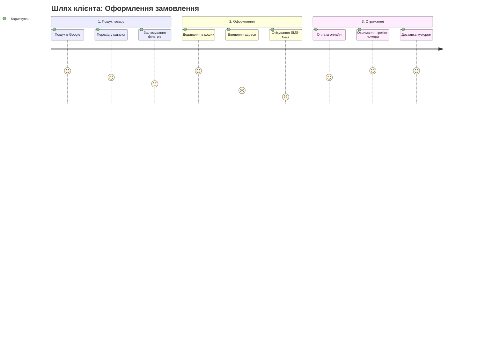

# Урок 109: Побудова шляху користувача під час взаємодії з продуктом

## 1. User Journey Mapping (CJM) як основа проєктування досвіду

**Customer / User Journey Map (CJM)** — це візуальне представлення послідовності кроків, думок, емоцій та бар'єрів, які проходить людина для досягнення своєї мети при взаємодії з продуктом або послугою.

На відміну від простої схеми екранів (User Flow), CJM фіксує:
- **Контекст поза додатком** (як користувач дізнався про проблему, що робив до відкриття сайту).
- **Емоційну криву (Emotional Curve)**: точки найвищого задоволення (Delight) та глибокої фрустрації (Drop-off risks).
- **Точки контакту (Touchpoints)**: мобільний додаток, email-сповіщення, SMS, кур'єр, розмова зі службою підтримки.

---

## 2. Ключові компоненти структури CJM

| Компонент | Опис | Приклад на кроці «Оплата» |
| :--- | :--- | :--- |
| **Етап (Stage)** | Загальна фаза життєвого циклу | «Фаза транзакції / Розрахунок» |
| **Дії користувача (User Actions)** | Що конкретно робить людина | Вводить реквізити картки або тисне Apple Pay |
| **Думки та очікування (Thoughts)** | Внутрішній діалог клієнта | «Чи безпечно тут платити? Чи зніме комісію?» |
| **Емоційний стан (Emotion / Mood)** | Рівень задоволеності (+ / 0 / -) | 😟 Тривожність через довге завантаження 3DS |
| **Боль / Бар'єр (Pain Point)** | Що заважає або лякає | Збій 3D-Secure банку без зрозумілої помилки |
| **Можливості (Opportunities)** | Ідеї покращення досвіду | Додати збережені картки, Apple Pay / Google Pay, кешбек |

---

## 3. Використання AI для побудови та аудиту CJM

Генеративний AI значно прискорює створення карт шляху:
1. **Генерація первинного каркасу CJM**: створення повної матриці етапів за вхідним описом бізнес-моделі та персони.
2. **Синтез емоційної шкали та думок**: AI моделює психологічні реакції для різних сегментів (новачок vs досвідчений користувач).
3. **Експорт у синтаксис Mermaid**: Швидка візуалізація та вставка діаграм у Notion, Jira чи GitHub без тривалого малювання в графічних редакторах.
