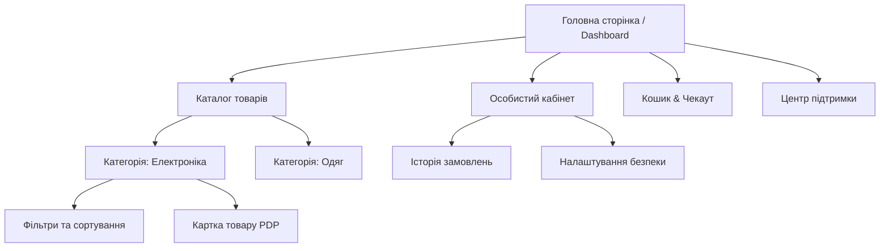
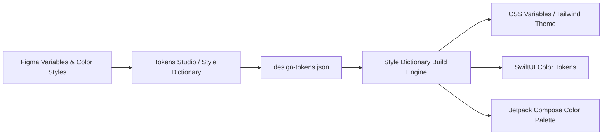

# Урок 109: Створення інформаційної архітектури та структури переходів

## Вступ та теоретичний фундамент
Інформаційна архітектура (Information Architecture — IA) є структурним кістяком будь-якого цифрового продукту. Вона визначає, як контент, функції та сервіси організовані, згруповані, позначені мітками (Labelling) та пов'язані навігаційними шляхами, щоб користувач міг інтуїтивно знайти потрібну інформацію з мінімальними когнітивними зусиллями.

Погана інформаційна архітектура призводить до того, що користувачі 'блукають' у лабіринтах підменю, не знаходять ключових функцій та відмовляються від сервісу, навіть якщо графічний дизайн окремих кнопок є бездоганним.

Застосування штучного інтелекту трансформує проектування IA:
1. **Автоматизоване кард-сортування (AI-Assisted Card Sorting & Clustering)**: Семантичне групування сотень категорій та сутностей на основі векторної близькості.
2. **Проектування деревоподібних карт сайту (Sitemap Generation)**: Створення ієрархічних структур з оптимізованою глибиною вкладеності (Click Depth <= 3).
3. **Оптимізація навігаційних таксономій та міток (Microcopy & Taxonomy)**: Добір зрозумілих термінів замість корпоративного жаргону.
4. **Контроль закону Хіка та когнітивного навантаження**: Розрахунок кількості виборів на кожному рівні меню для запобігання аналітичного паралічу (Analysis Paralysis).

У цьому уроці ви опануєте інженерні методики створення карт сайтів, проектування систем навігації та валідації архітектури за допомогою AI.

---

## 1. Архітектурні принципи та психологічні закони проектування IA
Інформаційна архітектура базується на фундаментальних законах когнітивної ергономіки:
- **Закон Хіка (Hick's Law)**: Час прийняття рішення зростає логарифмічно з кількістю та складністю варіантів вибору $T = b \cdot \log_2(n + 1)$.
- **Правило 3 кліків (3-Click Rule)**: Будь-яка критична інформація повинна бути доступна не більше ніж за 3 переходи від головної сторінки.
- **Принцип прогресивного розкриття (Progressive Disclosure)**: Показ лише базової інформації на першому екрані з можливістю занурення в деталі.




---

## 2. Методологічний базис: Порівняння моделей організації навігації
Порівняльний аналіз топологій навігаційних структур.


| Модель навігації | Структура переходів | Переваги | Коли застосовувати |
| :--- | :--- | :--- | :--- |
| **Ієрархічна (Дерево)** | Головна -> Категорія -> Підкатегорія -> Сторінка | Чітка структура, легко масштабувати контент | E-commerce каталоги, корпоративні портали |
| **Лінійна (Sequential)** | Крок 1 -> Крок 2 -> Крок 3 -> Фініш | Повний контроль фокусу, неможливо збитися з курсу | Майстри чекауту, онбординг, верифікація |
| **Хаб і спиці (Hub & Spoke)**| Центральний дашборд -> ізольовані підмодулі | Ідеально для мультизадачності, повернення в центр | Мобільні додатки банкінгу, CRM системи |
| **Фасетна (Matrix/Faceted)** | Пошук через комбінацію незалежних фільтрів | Максимальна гнучкість для досвідчених користувачів | Великі маркетплейси, бази наукових статей |

---

## 3. Практичний інженерний регламент: Промпт для генерації карти сайту та структури переходів
Професійний промпт для розробки повної структури інформаційної архітектури інтернет-магазину.


```markdown
# =====================================================================
# ПРОМПТ ДЛЯ AI: Генерація Information Architecture (Sitemap & Taxonomy)
# =====================================================================

Ти — Principal Information Architect.
Спроектуй вичерпну інформаційну архітектуру для B2B SaaS платформи управління логістикою.

Вимоги до результату:
1. **Sitemap у форматі Mermaid**: Деревоподібна структура сайту (глибина не більше 3 рівнів).
2. **Навігаційні системи**:
   - Primary Navigation (Головне меню).
   - Utility Navigation (Профіль, сповіщення, зміна мови).
   - Contextual Navigation (Хлібні крихти Breadcrumbs, швидкі дії).
3. **Система міток (Taxonomy & Labelling)**: Таблиця термінів (Оригінальний термін -> Зрозуміла користувачеві назва -> Обґрунтування).
4. **Контроль за законом Хіка**: Переконайся, що в кожному меню знаходиться не більше 5-7 пунктів одночасно.
```

---

## 4. Поглиблений аналіз виробничих кейсів, крайових випадків та антипатернів
Аналіз реальних збоїв через помилки в архітектурі переходів.


### Кейс 1: Антипатерн "Глибока могила" (The Deep Nesting Trap)
- **Проблема**: Щоб змінити номер телефону, користувач повинен був пройти шлях: Профіль -> Налаштування -> Акаунт -> Безпека -> Контакти -> Телефон (6 кліків).
- **Наслідок**: 40% звернень у техпідтримку складалися з прохання 'допоможіть змінити номер'.
- **Виправлення**: Винесення контактних даних на перший рівень вкладки 'Налаштування акаунту' (скорочення до 2 кліків).

### Кейс 2: Некоректні назви пунктів меню (Corporate Jargon Confusion)
- **Проблема**: Пункт поповнення балансу назвали 'Деривативні транзакції'.
- **Наслідок**: Падіння кількості поповнень на 35%, оскільки звичайні користувачі не розуміли сенсу терміну.

---

## 5. Покроковий операційний воркфлоу проектування IA
Алгоритм роботи інформаційного архітектора.


### Крок 1: Інвентаризація контенту (Content Inventory)
- Скласти повний список усіх сторінок, функцій та даних системи у таблиці.

### Крок 2: Автоматизоване кард-сортування за допомогою AI
- Згрупувати сутності за семантичними кластерами.

### Крок 3: Побудова карти сайту (Mermaid Diagram)
- Візуалізувати ієрархію та зв'язки сторінок.

### Крок 4: Tree Testing (Тестування дерева навігації)
- Перевірити на 5 користувачах швидкість знаходження цільової сторінки без візуального дизайну.

---

## 6. Стратегії оптимізації та контролю навігації
1. **Breadcrumb Trails**: Обов'язкове впровадження хлібних крихт для всіх сторінок глибше 1 рівня.
2. **Search-First Navigation**: Інтеграція розумного повнотекстового пошуку для великих таксономій.
3. **Analytics-Driven Pruning**: Регулярне видалення або приховування пунктів меню, якими користуються менше 1% відвідувачів.

---

## 7. Вичерпний чек-лист перевірки та критерії готовності (Definition of Done)
Перед здачею завдань та інтеграцією результатів у виробничу гілку переконайтеся у виконанні наступних критеріїв:

- [ ] **Глибина вкладеності ключових сценаріїв не перевищує 3 кліків (3-Click Rule)**
- [ ] **Головне меню містить не більше 5-7 пунктів згідно із законом Хіка**
- [ ] **Всі терміни та мітки перевірені на відсутність внутрішнього корпоративного жаргону**
- [ ] **Побудовано наочну Mermaid діаграму карти сайту (Sitemap)**
- [ ] **Передбачено контекстну навігацію (Breadcrumbs) для глибоких рівнів**
- [ ] **Проведено тестування дерева навігації (Tree Testing) на реалістичних завданнях**
- [ ] **Розроблено адаптивну версію меню для мобільних пристроїв (Hamburger / Bottom Nav)**
- [ ] **Архітектура затверджена командою розробки та SEO-спеціалістами**

---

## 8. Підсумки, ключові інсайти та розширений глосарій термінів
Опанування цієї теми формує надійний фундамент для щоденної професійної роботи. Системний підхід, формалізовані інженерні стандарти та критичний контроль результатів AI забезпечують високу швидкість та бездоганну надійність кінцевого продукту.

### Глосарій ключових понять
| Термін | Визначення та контекст застосування |
| :--- | :--- |
| **Information Architecture (IA)** | Дисципліна проектування структури та організації інформаційного простору веб-сайтів і додатків. |
| **Card Sorting** | Метод дослідження, при якому користувачі групують картки з назвами тем за зрозумілими їм категоріями. |
| **Tree Testing** | Метод оцінки зручності пошуку тем у спрощеній текстовій структурі сайту без візуального оформлення. |
| **Hick's Law** | Психологічний закон, згідно з яким час вибору варіанта зростає зі збільшенням кількості доступних альтернатив. |
| **Breadcrumbs** | Елемент навігаційного ланцюжка, що показує шлях від головної сторінки до поточного місцезнаходження користувача. |
| **Progressive Disclosure** | Техніка проектування інтерфейсу, що поступово відкриває складні деталі в міру необхідності. |
| **Sitemap** | Ієрархічна схема або список усіх сторінок і розділів сайту, що відображає його структуру. |
| **Taxonomy** | Система класифікації та ієрархічного структурування понять і категорій у додатку. |
| **Click Depth** | Кількість переходів за посиланнями, необхідна для досягнення цільової сторінки з головної. |
| **Bottom Navigation** | Панель навігації у нижній частині екрана мобільного додатку для швидкого перемикання між 3-5 головними розділами. |

---

## 9. Поглиблений аналіз психології сприйняття, дизайн-систем та дизайн-токенів

### 9.1. Математичні та ергономічні закони інтерфейсного проектування
Проектування цифрових інтерфейсів базується на фундаментальних законах психофізики:
1. **Закон Фіттса (Fitts's Law)**: Час досягнення цілі залежить від відстані до неї та її розміру:
   $$T = a + b \cdot \log_2\left(1 + \frac{D}{W}\right)$$
   Розміщення ключових дій (CTA) у кутах екрана або в зоні досяжності великого пальця на мобільних пристроях (Thumb Zone).
2. **Закон близькості та гештальт-психологія (Gestalt Principles)**: Елементи, розташовані близько один до одного, сприймаються мозком як взаємопов'язані. Використання 8-піксельної просторової сітки (8pt Spatial Grid).
3. **Кольоровий контраст та доступність (WCAG 2.2)**: Коефіцієнт контрастності тексту до фону не менше $4.5:1$ для звичайного тексту та $3:1$ для великих заголовків.

### 9.2. Архітектура Design Tokens та синхронізація Figma <-> Code



### 9.3. Розширений практичний кейс: Проектування темної теми (Dark Mode Ergonomics)
- **Проблема**: Проста інверсія кольорів (білий -> чисто чорний `#000000`) викликала сильне зорове напруження та ефект 'розмазування' (OLED Smearing).
- **Виправлення за допомогою AI**: Проектування багатошарової палітри сірих відтінків (`#121212`, `#1E1E1E`, `#2D2D2D`) з регулюванням глибини через піднесення поверхні (Surface Elevation & Elevation Overlay).

---

## 10. Питання для співбесіди та захист дизайн-концепцій (Principal Product Designer Level)

1. **Як ви доводите бізнесу необхідність інвестування у доступність інтерфейсів (Accessibility WCAG AAA)?**
   *Еталонна відповідь*: Доступність — це не лише благодійність, це розширення ринку (+15% користувачів з тимчасовими або постійними обмеженнями зору та моторики), прямий захист від судових позовів за законами ADA/EAA та значне покращення SEO і конверсії для всіх користувачів завдяки чіткій інформаційній структурі.
2. **Як за допомогою AI оптимізувати процес передачі макетів розробникам (Design Handoff)?**
   *Еталонна відповідь*: Використання генерації специфікацій за допомогою мультимодальних моделей: опис станів кнопок (Hover, Active, Focus, Disabled), фіксація точних відступів за дизайн-токенами, автоматичне формування CSS/Swift коду та інтеграція Figma Dev Mode.
3. **Як визначити, що продукт перевантажений когнітивним тертям (Cognitive Friction)?**
   *Еталонна відповідь*: Аналізом поведінкових метрик: високий рівень відмов (Drop-off Rate), довгий час перебування на простих формах (Time on Task), наявність 'Rage Clicks' (хаотичні швидкі кліки) та розбіжність між очікуваннями користувача на карті ментальних моделей і реальним флоу.

---

## 11. Практичний регламент проведення юзабіліті-тестувань та метрики продуктового UX

### 11.1. Стандартизовані кількісні метрики UX (SUS, SUPR-Q, UMUX)
Для перевірки успішності редизайну та валідації нових інтерфейсів використовуються визнані світові шкали:
1. **System Usability Scale (SUS)**: 10 стандартних запитань з 5-бальною шкалою Лайкерта. Цільовий результат для продукту світового рівня — не менше 80.3 балів (Grade A).
2. **Task Completion Rate (TCR)**: Відсоток користувачів, які змогли успішно завершити ключовий сценарій (ціль > 90%).
3. **Time on Task (ToT)**: Середній час, необхідний для досягнення результату (зменшення ToT свідчить про зниження когнітивного навантаження).
4. **Single Ease Question (SEQ)**: Одне запитання після виконання дії: *"Наскільки легко вам було виконати це завдання за шкалою від 1 (дуже важко) до 7 (дуже легко)?"* (ціль > 5.5).

### 11.2. Матриця перевірки доступності інтерфейсів (A11y Audit Checklist)
- **Focus Indicators**: Чітка візуальна рамка фокусу (Outline) товщиною не менше 2px при навігації з клавіатури (Tab navigation).
- **Touch Target Size**: Мінімальний розмір інтерактивних елементів на сенсорних екранах становить $48 \times 48\text{ dp}$ за стандартом Google Material Design або $44 \times 44\text{ pt}$ за Apple HIG.
- **Color Independence**: Інформація про помилку чи статус ніколи не повинна передаватися виключно кольором — обов'язкова наявність іконки або текстового пояснення (для людей з дальтонізмом).
