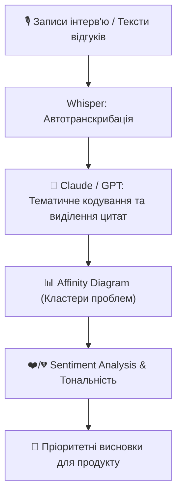

# Урок 110: Аналіз інтерв’ю, відгуків та іншої інформації від користувачів

## 1. Проблема обробки великих масивів якісних даних (Qualitative Data)

Після проведення серії з 15–20 глибинних інтерв'ю або вивантаження 1000 відгуків з App Store / Trustpilot дизайнер опиняється перед «стіною тексту». Ручна розмітка якісних даних займає тижні.

Генеративний штучний інтелект відкриває еру **AI-Assisted Qualitative Synthesis**:
- Миттєва транскрибація аудіо/відео записів інтерв'ю.
- Тематичне кодування (Thematic Coding) та тегування цитат.
- Sentiment Analysis (Аналіз тональності та емоційного забарвлення).
- Виявлення неочевидних кореляцій між сегментами клієнтів та типами скарг.



---

## 2. Тематичне кодування (Thematic Coding) за допомогою LLM

Тематичне кодування — це процес маркування уривків тексту специфічними мітками (кодами) для подальшої класифікації:
- **Описові коди (Descriptive Codes)**: факти та дії (`#search_failure`, `#pricing_confusion`).
- **Емоційні коди (Affective Codes)**: відчуття (`#frustrated_by_ads`, `#delighted_with_speed`).
- **Коди наслідків (Outcome Codes)**: фінальні рішення (`#abandoned_checkout`, `#uninstalled_app`).

### Приклад розмітки через промпт:
```markdown
Вхідна цитата: «Я намагався знайти веганську піцу, але фільтр показував усе підряд. Плюнув і замовив у конкурентів».
AI-тегування:
- [Тема]: Фільтрація каталогу
- [Код]: #broken_dietary_filter
- [Емоція]: Дратівливість (Frustration)
- [Наслідок]: Відтік до конкурента (Churn)
- [Критичність]: Висока (Lost Revenue)
```

---

## 3. Побудова Affinity Diagram (Діаграми спорідненості)

AI допомагає автоматично згрупувати сотні розрізнених стікерів за категоріями схожості:
1. **Інформаційна архітектура та навігація**.
2. **Прозорість ціноутворення та комісій**.
3. **Швидкість роботи та технічні збої**.
4. **Корисність специфічних функцій**.
