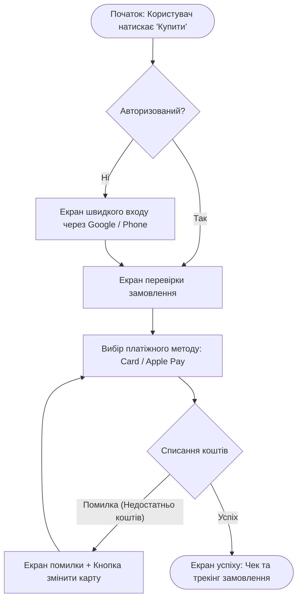
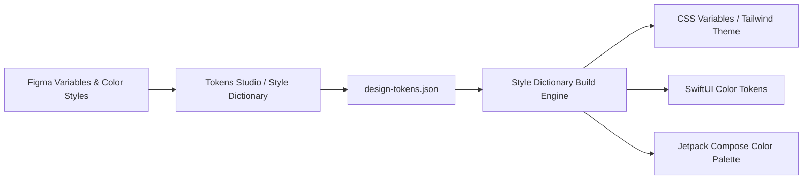

# Урок 110: Генерація та оптимізація User Flow за допомогою AI

## Вступ та теоретичний фундамент
Користувацький потік (User Flow) — це покрокова візуалізація шляху, який проходить користувач через інтерфейс програмного продукту для досягнення конкретної мети (наприклад, реєстрація, поповнення балансу, покупка квитка, зміна пароля). Якісно спроектований User Flow враховує не лише ідеальний шлях (Happy Path), а й усі можливі розвилки, альтернативні сценарії, помилки валідації та системні збої.

Створення заплутаних або перевантажених потоків призводить до високого відтоку (Chipping & Drop-off), розчарування користувачів та падіння бізнес-показників.

Використання штучного інтелекту дозволяє вивести проектування User Flow на новий рівень:
1. **Автоматична побудова графів переходів (State Flow Diagrams in Mermaid)**: Миттєва генерація чітких блок-схем за текстовим описом вимог.
2. **Аналіз та оптимізація тертя (Friction Points Reduction)**: AI виявляє зайві кроки, обов'язкові поля, які можна зробити опціональними, та пропонує скорочення воронки (Streamlining).
3. **Моделювання негативних та крайових гілок (Edge-Case Branching)**: Автоматичне додавання сценаріїв: 'Немає грошей на картці', 'Втрачено зв'язок', 'Сесія закінчилася'.
4. **Розрахунок кількості когнітивних кроків**: Оцінка складності флоу за шкалою Task Completion Effort.

У цьому уроці ви опануєте алгоритми проектування бездоганних User Flow за допомогою AI та навчитеся мінімізувати тертя у воронках конверсії.

---

## 1. Архітектурні принципи та анатомія ефективного User Flow
Кожен блок-елемент у діаграмі User Flow має стандартизоване значення:
- **Прямокутник (Screen / Action)**: Екран інтерфейсу або дія користувача.
- **Ромб (Decision Point)**: Точка прийняття рішення системою або користувачем (Так/Ні).
- **Скруглений прямокутник / Овал (Start / End State)**: Точка входу та фінальний результат.
- **Паралелограм (Input / Output)**: Введення даних або отримання сповіщення.




---

## 2. Методологічний базис: Порівняння рівнів деталізації флоу
Порівняльний аналіз типів діаграм перебігу дій.


| Тип діаграми | Рівень деталізації | Для кого призначена | Коли створювати |
| :--- | :--- | :--- | :--- |
| **Task Flow** | Високорівневий лінійний шлях без розвилок | Product Managers, стейкхолдери | На етапі концептуалізації фічі |
| **User Flow (Standard)** | Екрани + рішення користувача + помилки | UI/UX дизайнери, Frontend розробники | Перед створенням Wireframes у Figma |
| **Screen Flow (Wireflow)** | Поєднання реальних макетів екранів зі стрілками | Вся команда розробки | Під час фінального узгодження UI |
| **System State Flow** | Стани бекенду, події шини, коди статусів | Backend інженери, архітектори | При проектуванні мікросервісів та API |

---

## 3. Практичний інженерний регламент: Еталонний промпт для генерації та оптимізації User Flow
Професійний промпт для проектування оптимізованого флоу оформлення кредиту.


```markdown
# =====================================================================
# ПРОМПТ ДЛЯ AI: Генерація та оптимізація User Flow з обробкою помилок
# =====================================================================

Ти — Principal Product Experience Architect.
Спроектуй User Flow для сценарію: "Миттєве оформлення мікрокредиту в мобільному додатку".

Вимоги до результату:
1. **Діаграма Mermaid flowchart TD**: Повний шлях користувача від точки входу до зарахування грошей на карту.
2. **Всі альтернативні гілки та помилки**:
   - Відмова банку (Credit Rejected).
   - Помилка верифікації паспорта عبر Дія.
   - Помилка банку-еквайра при прив'язці карти.
3. **Оптимізація тертя (Friction Reduction)**:
   - Як скоротити кількість екранів до абсолютного мінімуму?
   - Які дані можна підтягнути автоматично без ручного вводу?
4. **Таблиця станів інтерфейсу (Screen States Matrix)**:
   - Екран -> Дія -> Стан завантаження -> Стан помилки -> Успіх.
```

---

## 4. Поглиблений аналіз виробничих кейсів, крайових випадків та антипатернів
Аналіз реальних проблем, викликаних неоптимальними користувацькими потоками.


### Кейс 1: Антипатерн "Глухий кут" (The Dead-End Flow Trap)
- **Проблема**: При помилці оплати додаток показував повідомлення "Помилка транзакції" без жодної кнопки повернення чи повторної спроби.
- **Наслідок**: Користувачі були змушені перезапускати додаток і втрачали вміст кошика.
- **Виправлення**: Правило 'Завжди надавати шлях виходу': додавання кнопок 'Спробувати іншу картку' або 'Зв'язатися з підтримкою'.

### Кейс 2: Передчасна вимога обов'язкової реєстрації (The Wall Anti-Pattern)
- **Проблема**: Додаток вимагав підтвердження пошти та пароля ще до того, як користувач міг побачити каталог товарів.
- **Наслідок**: Відтік 70% нових відвідувачів на першому екрані.
- **Виправлення**: Перенесення реєстрації на фінальний крок чекауту (Lazy Registration).

---

## 5. Покроковий операційний воркфлоу створення User Flow
Порядок дій продуктового дизайнера.


### Крок 1: Визначення мети користувача та початкової точки
- Сформулювати вхідну подію (Entry Point) та бажаний бізнес-результат.

### Крок 2: Генерація базового Happy Path у Mermaid через AI
- Створити ідеальний шлях за 3-5 кроків.

### Крок 3: Насичення флоу крайовими випадками (Edge Case Injection)
- Додати розгалуження на випадок збоїв мережі, відмов API та невалідних даних.

### Крок 4: Аудит на простоту (Streamlining Review)
- Об'єднати або видалити зайві кроки.

### Крок 5: Перенесення в Figma / FigJam для створення Wireframes
- Перетворити блоки діаграми на макети інтерфейсів.

---

## 6. Стратегії оптимізації та мінімізації тертя у воронках
1. **Auto-Fill & Defaults**: Автоматичне заповнення міста за геолокацією, збереження карток через Apple/Google Pay.
2. **Inline Validation**: Перевірка правильності введених даних прямо під час вводу без очікування кліку на кнопку відправлення.
3. **Single-Page Checkout**: Об'єднання доставки та оплати на одному компактному екрані.

---

## 7. Вичерпний чек-лист перевірки та критерії готовності (Definition of Done)
Перед здачею завдань та інтеграцією результатів у виробничу гілку переконайтеся у виконанні наступних критеріїв:

- [ ] **User Flow має чітку точку входу (Entry Point) та фінальний стан успіху**
- [ ] **Діаграма включає всі альтернативні та негативні гілки (Error States)**
- [ ] **Відсутні тупикові екрани (Dead Ends) — для кожної помилки передбачено дію виходу**
- [ ] **Усунуто непотрібні проміжні екрани та кліки (Streamlined Flow)**
- [ ] **Реєстрація та введення важких даних відкладені на найпізніший можливий момент**
- [ ] **Діаграма побудована за стандартом Mermaid flowchart та легко читається**
- [ ] **Всі кроки узгоджені з можливостями бекенд API**
- [ ] **Складено перелік станів завантаження (Loading / Skeleton States) для кожного кроку**

---

## 8. Підсумки, ключові інсайти та розширений глосарій термінів
Опанування цієї теми формує надійний фундамент для щоденної професійної роботи. Системний підхід, формалізовані інженерні стандарти та критичний контроль результатів AI забезпечують високу швидкість та бездоганну надійність кінцевого продукту.

### Глосарій ключових понять
| Термін | Визначення та контекст застосування |
| :--- | :--- |
| **User Flow** | Візуальна послідовність кроків та дій, яку здійснює користувач для виконання конкретного завдання в інтерфейсі. |
| **Happy Path** | Ідеальний безпомилковий шлях виконання користувацького завдання від початку до успішного кінця. |
| **Edge Case** | Рідкісна або екстремальна ситуація в роботі системи, що вимагає специфічної обробки інтерфейсом. |
| **Dead End** | Стан інтерфейсу, коли користувач не може продовжити рух або повернутися назад без перезапуску додатку. |
| **Lazy Registration** | Паттерн відкладеної реєстрації, коли створення акаунту вимагається лише у момент здійснення цільової дії. |
| **Wireflow** | Поєднання спрощених макетів екранів (Wireframes) зі стрілками перебігу дій (Flowchart). |
| **Friction Point** | Місце в інтерфейсі, де користувач відчуває труднощі, сумніви або уповільнює свій рух до мети. |
| **Decision Point** | Точка розгалуження в діаграмі потоку, де напрямок залежить від вибору людини або перевірки системи. |
| **Skeleton Screen** | Тимчасовий сірий макет інтерфейсу, що відображається під час завантаження реальних даних з сервера. |
| **Inline Validation** | Миготлива перевірка правильності заповнення поля вводу безпосередньо в момент втрати фокусу. |

---

## 9. Поглиблений аналіз психології сприйняття, дизайн-систем та дизайн-токенів

### 9.1. Математичні та ергономічні закони інтерфейсного проектування
Проектування цифрових інтерфейсів базується на фундаментальних законах психофізики:
1. **Закон Фіттса (Fitts's Law)**: Час досягнення цілі залежить від відстані до неї та її розміру:
   $$T = a + b \cdot \log_2\left(1 + \frac{D}{W}\right)$$
   Розміщення ключових дій (CTA) у кутах екрана або в зоні досяжності великого пальця на мобільних пристроях (Thumb Zone).
2. **Закон близькості та гештальт-психологія (Gestalt Principles)**: Елементи, розташовані близько один до одного, сприймаються мозком як взаємопов'язані. Використання 8-піксельної просторової сітки (8pt Spatial Grid).
3. **Кольоровий контраст та доступність (WCAG 2.2)**: Коефіцієнт контрастності тексту до фону не менше $4.5:1$ для звичайного тексту та $3:1$ для великих заголовків.

### 9.2. Архітектура Design Tokens та синхронізація Figma <-> Code



### 9.3. Розширений практичний кейс: Проектування темної теми (Dark Mode Ergonomics)
- **Проблема**: Проста інверсія кольорів (білий -> чисто чорний `#000000`) викликала сильне зорове напруження та ефект 'розмазування' (OLED Smearing).
- **Виправлення за допомогою AI**: Проектування багатошарової палітри сірих відтінків (`#121212`, `#1E1E1E`, `#2D2D2D`) з регулюванням глибини через піднесення поверхні (Surface Elevation & Elevation Overlay).

---

## 10. Питання для співбесіди та захист дизайн-концепцій (Principal Product Designer Level)

1. **Як ви доводите бізнесу необхідність інвестування у доступність інтерфейсів (Accessibility WCAG AAA)?**
   *Еталонна відповідь*: Доступність — це не лише благодійність, це розширення ринку (+15% користувачів з тимчасовими або постійними обмеженнями зору та моторики), прямий захист від судових позовів за законами ADA/EAA та значне покращення SEO і конверсії для всіх користувачів завдяки чіткій інформаційній структурі.
2. **Як за допомогою AI оптимізувати процес передачі макетів розробникам (Design Handoff)?**
   *Еталонна відповідь*: Використання генерації специфікацій за допомогою мультимодальних моделей: опис станів кнопок (Hover, Active, Focus, Disabled), фіксація точних відступів за дизайн-токенами, автоматичне формування CSS/Swift коду та інтеграція Figma Dev Mode.
3. **Як визначити, що продукт перевантажений когнітивним тертям (Cognitive Friction)?**
   *Еталонна відповідь*: Аналізом поведінкових метрик: високий рівень відмов (Drop-off Rate), довгий час перебування на простих формах (Time on Task), наявність 'Rage Clicks' (хаотичні швидкі кліки) та розбіжність між очікуваннями користувача на карті ментальних моделей і реальним флоу.

---

## 11. Практичний регламент проведення юзабіліті-тестувань та метрики продуктового UX

### 11.1. Стандартизовані кількісні метрики UX (SUS, SUPR-Q, UMUX)
Для перевірки успішності редизайну та валідації нових інтерфейсів використовуються визнані світові шкали:
1. **System Usability Scale (SUS)**: 10 стандартних запитань з 5-бальною шкалою Лайкерта. Цільовий результат для продукту світового рівня — не менше 80.3 балів (Grade A).
2. **Task Completion Rate (TCR)**: Відсоток користувачів, які змогли успішно завершити ключовий сценарій (ціль > 90%).
3. **Time on Task (ToT)**: Середній час, необхідний для досягнення результату (зменшення ToT свідчить про зниження когнітивного навантаження).
4. **Single Ease Question (SEQ)**: Одне запитання після виконання дії: *"Наскільки легко вам було виконати це завдання за шкалою від 1 (дуже важко) до 7 (дуже легко)?"* (ціль > 5.5).

### 11.2. Матриця перевірки доступності інтерфейсів (A11y Audit Checklist)
- **Focus Indicators**: Чітка візуальна рамка фокусу (Outline) товщиною не менше 2px при навігації з клавіатури (Tab navigation).
- **Touch Target Size**: Мінімальний розмір інтерактивних елементів на сенсорних екранах становить $48 \times 48\text{ dp}$ за стандартом Google Material Design або $44 \times 44\text{ pt}$ за Apple HIG.
- **Color Independence**: Інформація про помилку чи статус ніколи не повинна передаватися виключно кольором — обов'язкова наявність іконки або текстового пояснення (для людей з дальтонізмом).
