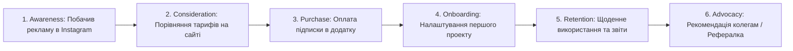
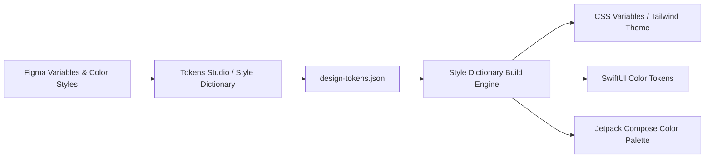

# Урок 111: Побудова Customer Journey Map (CJM) з виявленням больових точок

## Вступ та теоретичний фундамент
Карта шляху клієнта (Customer Journey Map — CJM) — це фундаментальний стратегічний інструмент продуктового дизайну, що візуалізує повну хронологічну історію взаємодії користувача з брендом та продуктом через усі точки контакту (Touchpoints) — від першого усвідомлення потреби через рекламу, онбординг, щоденне використання і аж до звернення в підтримку чи відмови від сервісу.

На відміну від локального User Flow, який фокусується лише на екранах додатку, CJM охоплює глобальний життєвий контекст людини: її емоційний стан, очікування, думки, больові точки та приховані бар'єри на кожній стадії взаємодії.

Штучний інтелект кардинально прискорює побудову та аналіз CJM:
1. **Мультисенсорна реконструкція досвіду (Holistic Journey Mapping)**: Генерація фаз Awareness -> Consideration -> Purchase -> Onboarding -> Retention -> Advocacy.
2. **Емоційне профілювання (Emotional Curve Tracking)**: Автоматична оцінка динаміки настрою користувача від захоплення (+5) до розчарування (-5).
3. **Виявлення системних прогалин між каналами (Omnichannel Friction Identification)**: Аналіз збоїв при переході між веб-сайтом, мобільним додатком, SMS-сповіщеннями та кур'єрською доставкою.
4. **Генерація можливостей для зростання (Opportunities & How Might We)**: Перетворення кожної виявленої проблеми на конкретну інженерну ініціативу (HMW Questions).

У цьому уроці ви опануєте інженерну методику створення CJM за допомогою AI, навчитеся виявляти критичні больові точки та проектувати системні покращення продукту.

---

## 1. Архітектурні принципи та матрична структура еталонної CJM
Професійна CJM будується у вигляді матриці, де стовпці — це хронологічні фази шляху, а рядки — виміри користувацького досвіду:
1. **Етап подорожі (Journey Stage)**: Фаза взаємодії.
2. **Ціль та дії користувача (User Goals & Actions)**: Що саме робить людина.
3. **Точки контакту (Touchpoints & Channels)**: Де відбувається взаємодія (Google Ads, iOS App, Push, Call-center).
4. **Думки та очікування (Thoughts & Mindset)**: Про що думає користувач.
5. **Емоційний графік (Emotional Score -5..+5)**: Крива радості/тривоги.
6. **Больові точки та бар'єри (Pain Points & Blockers)**: Що викликає збій чи роздратування.
7. **Можливості для продукту (Opportunities / HMW)**: Що ми можемо покращити.




---

## 2. Методологічний базис: Порівняння артефактів дослідження клієнтського досвіду
Порівняльний аналіз CJM, Service Blueprint та User Flow.


| Артефакт дослідження | Масштаб охоплення | Головний фокус | Для кого створюється |
| :--- | :--- | :--- | :--- |
| **Customer Journey Map (CJM)** | Глобальний наскрізний шлях клієнта | Емоції, думки, біль та досвід користувача | C-Level, дизайнери, маркетинг |
| **Service Blueprint** | Повний шлях + внутрішні процеси компанії | Фронтстейдж (персонал) + Бекстейдж (сервери, склади) | Operations, системні архітектори |
| **User Flow** | Локальний сценарій всередині інтерфейсу | Екрани, кнопки, розвилки та переходи | UI/UX дизайнери, розробники |
| **Empathy Map** | Зріз внутрішнього стану персони | Що чує, бачить, говорить, думає, відчуває | UX дослідники на початку проекту |

---

## 3. Практичний інженерний регламент: Еталонний промпт для побудови комплексної CJM
Професійний системний промпт для генерації вичерпної CJM для телемедичного сервісу.


```markdown
# =====================================================================
# ПРОМПТ ДЛЯ AI: Генерація повної Customer Journey Map (CJM) з HMW
# =====================================================================

Ти — Principal Service Experience Architect та Head of Design.
Створи комплексну Customer Journey Map для сервісу: "Онлайн-консультації з лікарями у смартфоні (Telehealth App)".
Персона: "Андрій, 34 роки, підозрює у дитини алергію пізно ввечері, перебуває у стані стресу".

Сформуй Markdown таблицю за 6 фазами (Awareness -> Search -> Booking -> Consultation -> Post-care -> Referral):
Для кожної фази детально розпиши 7 вимірів:
1. User Actions (Конкретні кроки Андрія).
2. Touchpoints & Channels (Смартфон, веб, сповіщення, відеозв'язок).
3. User Thoughts (Пряма внутрішня мова: "Чи це кваліфікований лікар?").
4. Emotional Score (-5 до +5 з описом емоції).
5. Pain Points (Що викликає затримку або страх).
6. Moment of Truth (Критичний момент вибору: залишитися чи піти).
7. Opportunities (How Might We: 2 інженерні та дизайнерські ініціативи для усунення болю).
```

---

## 4. Поглиблений аналіз виробничих кейсів, крайових випадків та антипатернів
Аналіз реальних випадків провалу продуктів через прогалини в Customer Journey.


### Кейс 1: "Провал на етапі Post-care" у сервісі доставки
- **Проблема**: Додаток мав ідеальний інтерфейс замовлення, але після оплати користувач не отримував жодних сповіщень 45 хвилин.
- **Наслідок**: Емоційний бал падав з +4 до -5, користувачі обривали лінію підтримки з криками "де моя їжа?".
- **Виправлення за допомогою CJM**: Впровадження інтерактивного трекінгу кур'єра на карті в реальному часі та push-сповіщень на ключових статусах.

### Кейс 2: Розрив між маркетингом та реальним продуктом (Expectation Gap)
- **Проблема**: Реклама обіцяла "безкоштовні консультації за 1 хвилину", але при вході в додаток вимагалося ввести дані кредитної картки та чекати лікаря 20 хвилин.
- **Наслідок**: Відтік 85% лідів з реклами та негативні відгуки в App Store (1.8 зірки).
- **Виправлення**: Синхронізація маркетингових меседжів з реальними можливостями сервісу.

---

## 5. Покроковий операційний воркфлоу створення та презентації CJM
Порядок побудови CJM продуктовою командою.


### Крок 1: Вибір цільової персони та її головної мети
- Зафіксувати архетип користувача та початковий контекст ситуації.

### Крок 2: Генерація структури CJM через AI з деталізацією фаз
- Надіслати промпт у Claude та отримати первинну матрицю досвіду.

### Крок 3: Валідація точок болю на реальних даних інтерв'ю та аналітики
- Підтвердити кожну больову точку фактами та відгуками реальних клієнтів.

### Крок 4: Перенесення в Miro / FigJam та генерація беклогу ініціатив
- Перетворити блок 'Opportunities' на готові продуктові завдання у Jira.

---

## 6. Стратегії впровадження інсайтів CJM у виробництво
1. **Moments of Truth Focus**: Першочергове покращення тих точок контакту, які безпосередньо впливають на рішення про покупку.
2. **Service Blueprint Alignment**: Синхронізація клієнтського досвіду з бекенд-процесами та регламентами служби підтримки.
3. **Dynamic Living CJM**: Оновлення карти раз на півроку за результатами нових продуктових релізів.

---

## 7. Вичерпний чек-лист перевірки та критерії готовності (Definition of Done)
Перед здачею завдань та інтеграцією результатів у виробничу гілку переконайтеся у виконанні наступних критеріїв:

- [ ] **CJM побудована для конкретної чітко визначеної User Persona**
- [ ] **Охоплено всі фази життєвого циклу від знайомства до рекомендації**
- [ ] **Для кожного етапу розписано дії, думки, емоції, точки контакту та біль**
- [ ] **Побудовано наочний графік емоційної кривої користувача (Emotional Score)**
- [ ] **Визначено ключові 'Моменти істини' (Moments of Truth)**
- [ ] **Кожна больова точка перетворена на конструктивне питання 'Як ми можемо...?' (HMW)**
- [ ] **Ініціативи з CJM внесені до продуктового беклогу в Jira/Linear**
- [ ] **CJM презентована стейкхолдерам та доступна всій команді у FigJam/Miro**

---

## 8. Підсумки, ключові інсайти та розширений глосарій термінів
Опанування цієї теми формує надійний фундамент для щоденної професійної роботи. Системний підхід, формалізовані інженерні стандарти та критичний контроль результатів AI забезпечують високу швидкість та бездоганну надійність кінцевого продукту.

### Глосарій ключових понять
| Термін | Визначення та контекст застосування |
| :--- | :--- |
| **Customer Journey Map (CJM)** | Візуалізація повної історії взаємодії клієнта з компанією у часі крізь усі точки контакту та канали. |
| **Touchpoint** | Будь-яка точка контакту або взаємодії клієнта з продуктом, сервісом, сайтом чи персоналом компанії. |
| **Moment of Truth** | Критичний момент взаємодії, коли у клієнта формується вирішальне враження про бренд, що визначає подальшу лояльність. |
| **Emotional Curve** | Графік коливань емоційного стану клієнта (від захоплення до розчарування) вздовж його шляху взаємодії. |
| **How Might We (HMW)** | Формат постановки задач у дизайн-мисленні, що перетворює виявлені проблеми на надихаючі можливості для інновацій. |
| **Service Blueprint** | Детальна схема операційних процесів компанії, яка показує, що відбувається 'за лаштунками' для забезпечення досвіду CJM. |
| **Drop-off** | Втрата потенційного клієнта, який припинив взаємодію з продуктом на певному кроці воронки. |
| **Omnichannel Experience** | Безшовний та узгоджений досвід користувача при перемиканні між різними каналами зв'язку (веб, мобільний додаток, офлайн). |
| **Post-Care Stage** | Фаза підтримки та супроводу клієнта після здійснення покупки або надання основної послуги. |
| **Net Promoter Score (NPS)** | Метрика лояльності клієнтів, що вимірює їхню готовність рекомендувати продукт своїм друзям та колегам. |

---

## 9. Поглиблений аналіз психології сприйняття, дизайн-систем та дизайн-токенів

### 9.1. Математичні та ергономічні закони інтерфейсного проектування
Проектування цифрових інтерфейсів базується на фундаментальних законах психофізики:
1. **Закон Фіттса (Fitts's Law)**: Час досягнення цілі залежить від відстані до неї та її розміру:
   $$T = a + b \cdot \log_2\left(1 + \frac{D}{W}\right)$$
   Розміщення ключових дій (CTA) у кутах екрана або в зоні досяжності великого пальця на мобільних пристроях (Thumb Zone).
2. **Закон близькості та гештальт-психологія (Gestalt Principles)**: Елементи, розташовані близько один до одного, сприймаються мозком як взаємопов'язані. Використання 8-піксельної просторової сітки (8pt Spatial Grid).
3. **Кольоровий контраст та доступність (WCAG 2.2)**: Коефіцієнт контрастності тексту до фону не менше $4.5:1$ для звичайного тексту та $3:1$ для великих заголовків.

### 9.2. Архітектура Design Tokens та синхронізація Figma <-> Code



### 9.3. Розширений практичний кейс: Проектування темної теми (Dark Mode Ergonomics)
- **Проблема**: Проста інверсія кольорів (білий -> чисто чорний `#000000`) викликала сильне зорове напруження та ефект 'розмазування' (OLED Smearing).
- **Виправлення за допомогою AI**: Проектування багатошарової палітри сірих відтінків (`#121212`, `#1E1E1E`, `#2D2D2D`) з регулюванням глибини через піднесення поверхні (Surface Elevation & Elevation Overlay).

---

## 10. Питання для співбесіди та захист дизайн-концепцій (Principal Product Designer Level)

1. **Як ви доводите бізнесу необхідність інвестування у доступність інтерфейсів (Accessibility WCAG AAA)?**
   *Еталонна відповідь*: Доступність — це не лише благодійність, це розширення ринку (+15% користувачів з тимчасовими або постійними обмеженнями зору та моторики), прямий захист від судових позовів за законами ADA/EAA та значне покращення SEO і конверсії для всіх користувачів завдяки чіткій інформаційній структурі.
2. **Як за допомогою AI оптимізувати процес передачі макетів розробникам (Design Handoff)?**
   *Еталонна відповідь*: Використання генерації специфікацій за допомогою мультимодальних моделей: опис станів кнопок (Hover, Active, Focus, Disabled), фіксація точних відступів за дизайн-токенами, автоматичне формування CSS/Swift коду та інтеграція Figma Dev Mode.
3. **Як визначити, що продукт перевантажений когнітивним тертям (Cognitive Friction)?**
   *Еталонна відповідь*: Аналізом поведінкових метрик: високий рівень відмов (Drop-off Rate), довгий час перебування на простих формах (Time on Task), наявність 'Rage Clicks' (хаотичні швидкі кліки) та розбіжність між очікуваннями користувача на карті ментальних моделей і реальним флоу.

---

## 11. Практичний регламент проведення юзабіліті-тестувань та метрики продуктового UX

### 11.1. Стандартизовані кількісні метрики UX (SUS, SUPR-Q, UMUX)
Для перевірки успішності редизайну та валідації нових інтерфейсів використовуються визнані світові шкали:
1. **System Usability Scale (SUS)**: 10 стандартних запитань з 5-бальною шкалою Лайкерта. Цільовий результат для продукту світового рівня — не менше 80.3 балів (Grade A).
2. **Task Completion Rate (TCR)**: Відсоток користувачів, які змогли успішно завершити ключовий сценарій (ціль > 90%).
3. **Time on Task (ToT)**: Середній час, необхідний для досягнення результату (зменшення ToT свідчить про зниження когнітивного навантаження).
4. **Single Ease Question (SEQ)**: Одне запитання після виконання дії: *"Наскільки легко вам було виконати це завдання за шкалою від 1 (дуже важко) до 7 (дуже легко)?"* (ціль > 5.5).

### 11.2. Матриця перевірки доступності інтерфейсів (A11y Audit Checklist)
- **Focus Indicators**: Чітка візуальна рамка фокусу (Outline) товщиною не менше 2px при навігації з клавіатури (Tab navigation).
- **Touch Target Size**: Мінімальний розмір інтерактивних елементів на сенсорних екранах становить $48 \times 48\text{ dp}$ за стандартом Google Material Design або $44 \times 44\text{ pt}$ за Apple HIG.
- **Color Independence**: Інформація про помилку чи статус ніколи не повинна передаватися виключно кольором — обов'язкова наявність іконки або текстового пояснення (для людей з дальтонізмом).
