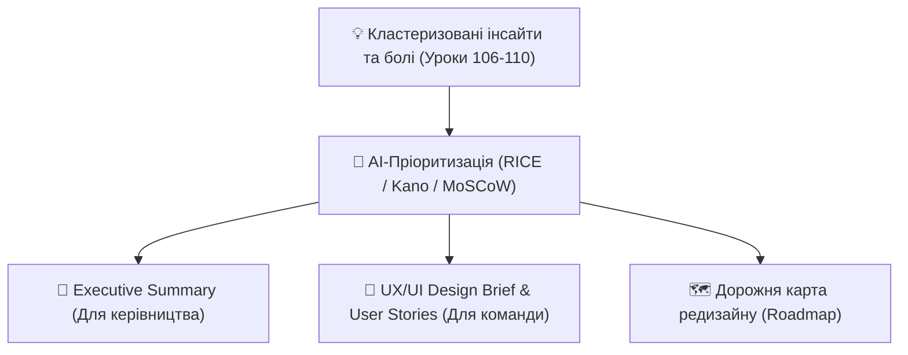

# Урок 111: Узагальнення результатів досліджень за допомогою AI

## 1. Від дослідницького аналізу до фінальної стратегії продукту

Фінальним етапом UX-дослідження є створення стислого, переконливого та дієвого звіту (Research Synthesis / Executive Summary), який об'єднує інсайти та трансформує їх у технічні вимоги для інженерів і дизайнерів.

Сучасний продуктовий дизайнер використовує AI як потужного **стратегічного редактора**:
- Формулювання стислих тез (TL;DR) для топ-менеджменту.
- Побудова матриць пріоритизації функцій (RICE / MoSCoW / Kano Model).
- Переклад якісних знахідок на мову User Stories та Acceptance Criteria (Gherkin).

---

## 2. Фреймворки пріоритизації продуктових знахідок

### А. Модель Кано (Kano Model)
Допомагає класифікувати функції за рівнем впливу на задоволеність користувача:
1. **Базові (Must-be / Basic)**: якщо їх немає — користувач лютує (наприклад, стабільний логін). Їх наявність сприймається як належне.
2. **Лінійні (Performance / One-dimensional)**: чим більше/швидше — тим краще (наприклад, швидкість завантаження сторінки).
3. **Захоплюючі (Delighters / Attractive)**: неочікувані приємні фічі, які викликають WOW-ефект (наприклад, розумні автопідказки AI).

### Б. Оцінка за шкалою RICE
$$RICE\ Score = rac{Reach 	imes Impact 	imes Confidence}{Effort}$$
- **Reach (Охоплення)**: скільки користувачів торкнеться зміна за період.
- **Impact (Вплив)**: наскільки це змінить конверсію (0.25 = мінімально, 3 = масивно).
- **Confidence (Впевненість)**: 100% = є дані досліджень, 50% = гіпотеза.
- **Effort (Зусилля)**: трудовитрати команди в людино-місяцях.

---

## 3. Генерація дизайн-брифінгу та User Stories

AI допомагає автоматично сформулювати завдання для Figma та Jira:
> **User Story:**
> *Як покупець інтернет-магазину,*
> *Я хочу бачити реальний розмір товару у своїй кімнаті через доповнену реальність,*
> *Щоб переконатися, що меблі підійдуть за габаритами до оформлення замовлення.*
>
> **Acceptance Criteria (Gherkin):**
> - **Given** користувач знаходиться на картці товару,
> - **When** натискає кнопку «Приміряти в кімнаті»,
> - **Then** відкривається камера з 3D моделлю у масштабі 1:1.
